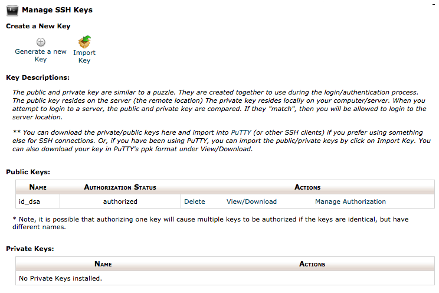
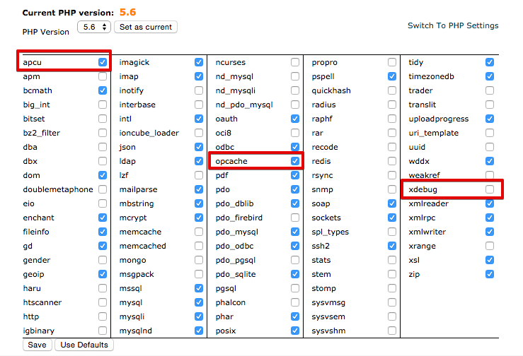
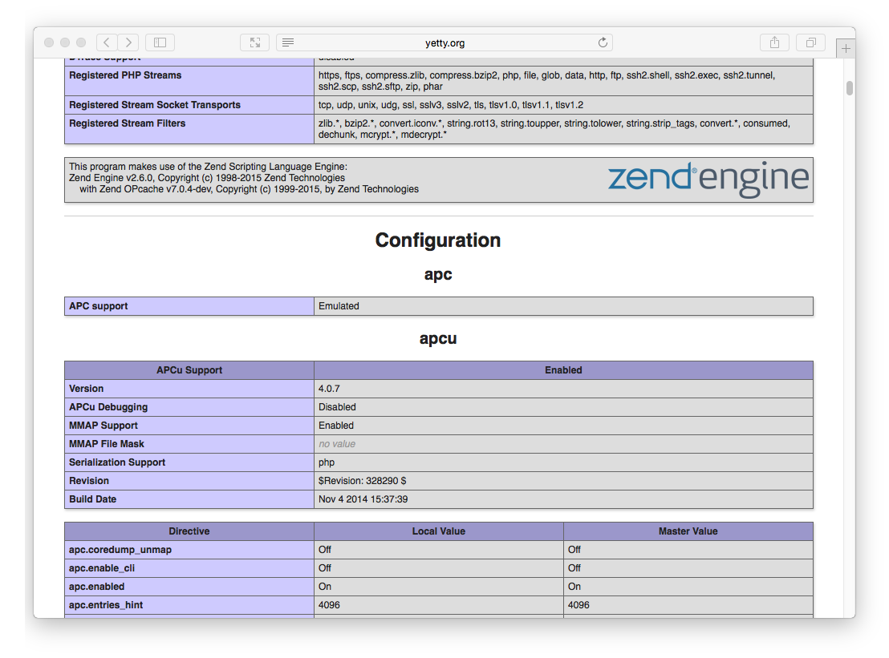

> [!訳注]  
> このページは、内容的に日本のサービスではないので、日本の方で、このページを読む人はほとんどいないと思いますが、以下の内容は PHP バージョンの話などから類推するにかなり古い内容であり、もし読む必要がある場合でも、適宜読み替えながら読んでください。

[Rochen Web Hosting](http://www.rochen.com/?utm_source=RocketTheme&utm_medium=Showcase&utm_campaign=Promotions) は、 **GetGrav.org** と **RocketTheme.com** 両方の昔からのホスティングパートナーです。
Rochen は現在、新しくプレミアムな共有ホスティングサービスを提供しており、 **SSD ドライブ** や **Litespeed** ウェブサーバーを使い、最新の **Intel XEON プロセッサ** によることで、 Grav の最適化されたパフォーマンスを保証します。
また、アメリカもしくはイギリスのサーバーを選べるので、あなたのユーザーにとって最良の選択ができます。


<h2 id="picking-your-hosting-plan">ホスティングプランを決める</h2>

[Rochen Web Hosting](http://www.rochen.com/?utm_source=RocketTheme&utm_medium=Showcase&utm_campaign=Promotions) には、 **Shared** と **Burst** の2つのホスティングのオプションがあります。Rochen は、より忙しく、要求のより高いサイトには Burst オプションを推奨しています。このガイドでは、基本的な Shared オプションを使用します。

Shared ホスティングは、コミットメントの長さによって、月額 $7.95 から $13.95 の間の料金です。

<h2 id="enabling-ssh">SSH を有効化</h2>

まず、 cPanel の **Security** セクションで、 **Toggle SSH Access** オプションを開かなければいけません。この SSH アクセスページで、 **SSH アクセスを有効化** するボタンをクリックしてください。

それから、 **Security Section** で再度、 **SSH キー管理** オプションをクリックします。


この時、2つの選択肢があります。 **新しい鍵を生成** するか **鍵をインポート** するかです。公開・秘密鍵のペアをローカルコンピュータで作成し、 DSA パブリックキーをインポートするだけの方が簡単です。

> [!Info]  
> Windows ユーザーは、多くの便利な GNU と Mac や Linux プラットフォームで使える便利なツールを提供するため、まず [Cygwin](https://www.cygwin.com/) のインストールが必要です。パッケージ選択プロンプトでは、 SSH オプションに確実にチェックを入れてください。インストール後、 `Cygwin Terminal` を立ち上げてください。

ターミナルウインドウを立ち上げ、次のようにタイプしてください：

```bash
ssh-keygen -t dsa
```

この鍵の生成スクリプトは、いくつかの値を入力させるプロンプトを表示します。デフォルト値を許容できる場合は、 `[return]` キーを押すだけでも良いです。このスクリプトは、ホームディレクトリの `.ssh/` というフォルダに、 `id_dsa` （秘密鍵）と、 `id_dsa.pub` （公開鍵）を作成します。秘密鍵を与えたり、どこかにアップロードするようなことは **決してしないでください** 。してよいのは、 **公開鍵だけです** 。

> [!訳注]  
> dsa でのキー生成は、2025年現在では、安全とは言えないような気もします。安全なキー生成の方法を調べてください。

鍵を生成できたら、 **SSH Access** ページの **Import SSH key** セクションで、 `Public Key` 入力欄に `id_dsa.pub` パブリックキーの中身を貼り付けできます：


アップロード後、 SSH 鍵管理ページの **Public Keys** セクションで鍵のリストを確認してください。それから、 **Manage** をクリックする必要があります。そのキーが認証されたことが確認されます：



あなたのアカウントで **SSH アクセスを有効化** するためには、 **my.rochen.com** ポータルの **Managed Services** セクションに移動し、 **Shared Hosting** アカウント情報をクリックするだけです。 **SSH** オプションの隣に、 **無効化** リンクをクリックし、SSH を有効化することを確定してください。

これで、サーバーに SSH テストする準備ができました。

```bash
ssh rochen_username@rochen_servername
```

言うまでもなく、 `rochen_username` には Rochen から提供されているユーザー名を、 `rochen_servername` には Rochen から提供されているサーバー名を入力する必要があります。

<h2 id="configuring-php-caching">PHP とキャッシュの設定</h2>

Rochen は、デフォルトで PHP **5.4** を使用します。しかし、 Grav に必要な、より新しい **5.5** や **5.6** を使うためのオプションがあります。

最初にやるべきことは、サイトが実行される PHP のデフォルトバージョンを変更することです。**Software and Services** セクションの **Select PHP Version** リンクをクリックしてください。

現在の PHP バージョンが表示されたページになるでしょう。以下の画像は、代替バージョンを選択しうるドロップダウンです。
**5.6** を選択し、 `Set as current` ボタンをクリックしてください。



Rochen は、ホスティングプロバイダ業界では珍しく、 PHP の高度なキャッシュ拡張機能を提供しています。これらを利用するには、 `apcu` キャッシュ拡張と Zend `opcache` 拡張の両方を有効化してください。それから、これらのオプションの下にある `Save` をクリックしてください。

最適化のひとつとして、 `xdebug` を **無効化** することができます。これは、デフォルトでは有効になっており、しかし本番環境では処理を遅くし、不要なものです。

**現在の PHP バージョン** と **Zend OPcache** と **APCu** が実行されているかテストするために、一時ファイル： `public_html/info.php` を作成し、以下のコンテンツを書き込んでください：

```php
<?php phpinfo();
```

ファイルを保存し、ブラウザでサイト内のこの info.php ファイルを開いてください。先ほど選択したバージョンが反映された PHP 情報が表示されます：


また、下へスクロールして **zend engine** ブロックの **Zend OPcache** 一覧と、その下の **APCu** セクションを確認できます：



<h2 id="install-and-test-grav">Grav のインストールとテスト</h2>

この SSH 機能を使って、（未接続ならば） Rochen サーバーに接続し、最新バージョンの Grav をダウンロードし、 zip 展開し、テストしてみましょう！

`/grav` サブフォルダに Grav を展開します。 Grav に直接アクセスできるように、 web ルートである `~/www/` フォルダに直接 unzip することもできます。

```bash
cd ~/www
wget https://getgrav.org/download/core/grav/latest
unzip grav-v{{ grav_version }}.zip
```

ブラウザで、 `http://myrochenserver.com/grav` などが表示できるはずです。もちろん、適切な URL に修正して使ってください。

ここまでの解説の通りに進めていただきましたので、 [Grav CLI](../../../07.cli-console/02.grav-cli/) や [Grav GPM](../../../07.cli-console/04.grav-cli-gpm/) も利用可能となります：

```bash
cd ~/public_html/grav
bin/grav clear-cache

Clearing cache

Cleared:  cache/twig/*
Cleared:  cache/doctrine/*
Cleared:  cache/compiled/*
Cleared:  cache/validated-*
Cleared:  images/*
Cleared:  assets/*

Touched: /home/your_user/public_html/grav/user/config/system.yaml
```

