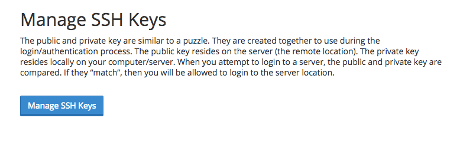
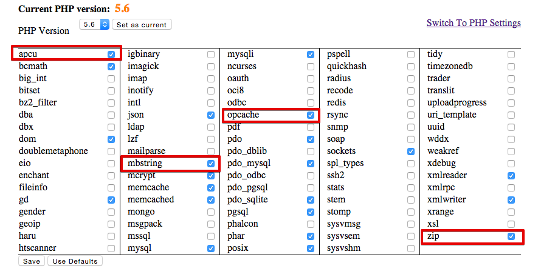
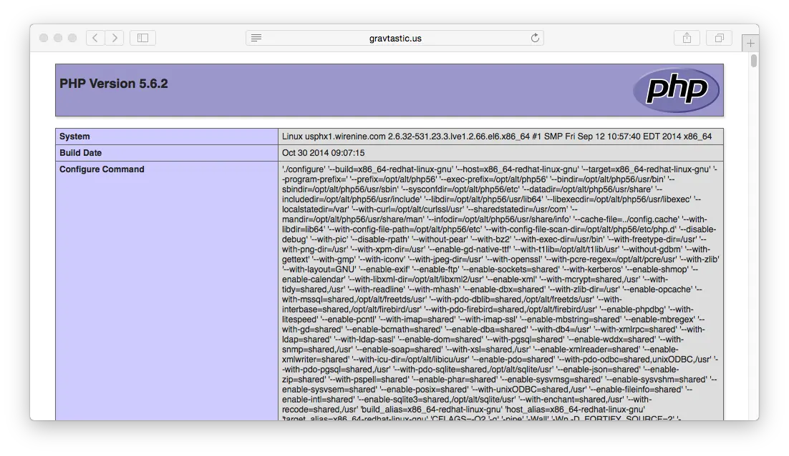
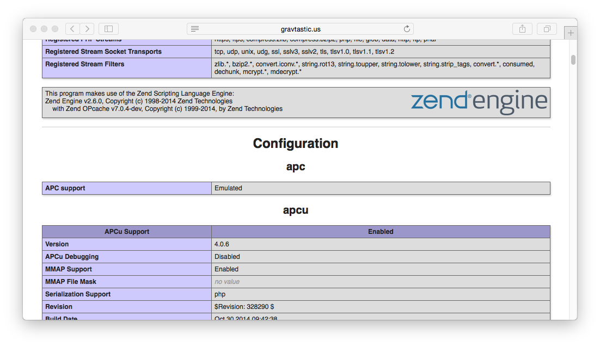
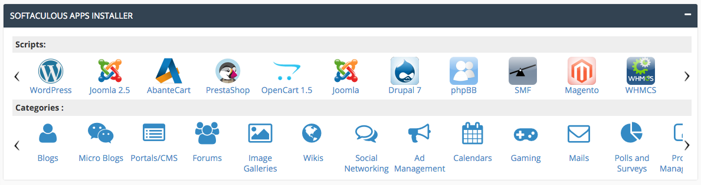
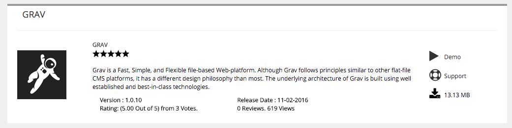
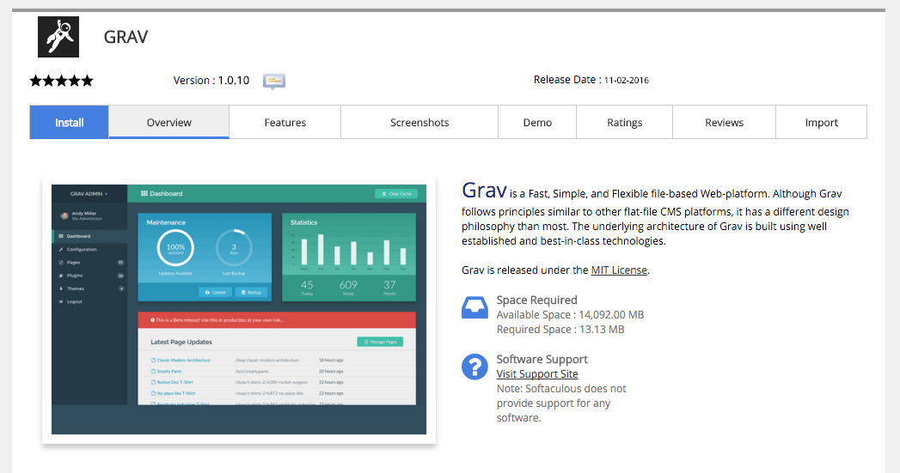
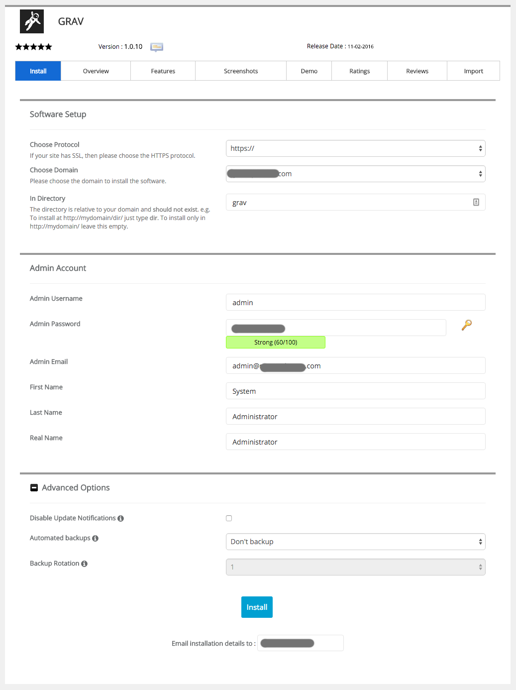

> [!訳注]  
> このページの内容は、日本向けのサービスではないため、日本の方が読む機会はほとんどないと思います。また、 PHP のバージョンなどから判断して、かなり古い情報が書かれているようです。もし読む必要がある場合は、古い情報であることを理解したうえで、適宜読み替えてください。

[WireNine](https://my.wirenine.com/aff.php?aff=023) は処理が速く、モダンなホスティングプロバイダです。同社は、パフォーマンスに焦点を当て、 **100% SSD** ストレージと、 **Litespeed** ウェブサーバー、高速な **DDR4 ram** とともに最新の **Intel E5-based** プロセッサを利用しています。
これらの機能は、彼らのレンタルサーバーが Grav サイトの素晴らしい解決策となってくれることを保証しています。


このガイドでは、 Grav で最適に動作するために、中間のレンタルサーバーアカウントを設定するために必要な知識を解説します。

<h2 id="picking-your-hosting-plan">ホスティングプランを決める</h2>

[WireNine](https://my.wirenine.com/aff.php?aff=023) には、3つのレンタルサーバープランがあります。最安は月額 $9 のベーシックプランから、月額 $18 のヘビーな通信量オプションのあるプランまであります。これらすべての設定は同じですが、私たちは中間の **Plus** プラン（月額 $14 ）をおすすめしています。なぜなら、 1 CPU 及び 1GB のメモリーが付き、妥当な提供プランだからです。

<h2 id="enabling-ssh">SSH を有効化</h2>

まず、 cPanel の **Security** セクションで、 **Toggle SSH Access** オプションを開かなければいけません。この SSH アクセスページで、 **SSH アクセスを有効化** するボタンをクリックしてください。



この時、2つの選択肢があります。 **新しい鍵を生成** するか **鍵をインポート** するかです。公開・秘密鍵のペアをローカルコンピュータで作成し、 DSA パブリックキーをインポートするだけの方が簡単です。

> [!Info]  
> Windows ユーザーは、多くの便利な GNU と Mac や Linux プラットフォームで使える便利なツールを提供するため、まず [Cygwin](https://www.cygwin.com/) のインストールが必要です。パッケージ選択プロンプトでは、 SSH オプションに確実にチェックを入れてください。インストール後、 `Cygwin Terminal` を立ち上げてください。

ターミナルウインドウを立ち上げ、次のようにタイプしてください：

```bash
ssh-keygen -t dsa
```

この鍵の生成スクリプトは、いくつかの値を入力させるプロンプトを表示します。デフォルト値を許容できる場合は、 `[return]` キーを押すだけでも良いです。このスクリプトは、ホームディレクトリの `.ssh/` というフォルダに、 `id_dsa` （秘密鍵）と、 `id_dsa.pub` （公開鍵）を作成します。プライベートキーを与えたり、どこかにアップロードするようなことは **決してしないでください** 。してよいのは、 **公開鍵だけです** 。

> [!訳注]  
> dsa でのキー生成は、2025年現在では、安全とは言えないような気もします。安全なキー生成の方法を調べてください。

鍵を生成できたら、 **SSH Access** ページの **Import SSH key** セクションで、 `Public Key` 入力欄に `id_dsa.pub` パブリックキーの中身を貼り付けできます：


アップロード後、 SSH 鍵管理ページの **Public Keys** セクションで鍵のリストを確認してください。それから、 **Manage** をクリックする必要があります。そのキーが認証されたことが確認されます：


> [!Info]  
> WireNine は、デフォルトでは **Shell Access** を有効化していないようです。サポートチケットを開き、あなたのアカウントに対してシェルアクセスを有効化するようリクエストする必要があるでしょう。

これで、サーバーに SSH テストする準備ができました。

```bash
ssh wirenine_username@wirenine_servername -p2200
```

言うまでもなく、 `wirenine_username` には WireNine から提供されているユーザー名を、 `wirenine_servername` には WireNine から提供されているサーバー名を入力する必要があります。 `-p2200` は、WireNine が SSH を標準とは違うポート番号で実行しているため、必要なものです。

<h2 id="403-forbidden-errors">403 Forbidden エラー</h2>

WireNine のセットアップにおいて、ユーザー作成ファイルのデフォルトのパーミッションが正しくなく、セキュリティフラグが発火して **403 Forbidden** エラーが起きるようです。この問題は、デフォルトの **umask が不正** であることで、作成されたフォルダが `775` 、 ファイルが `664` となってしまいます。これらのファイルは、正しくは `755` 及び `644` のときにそれぞれ機能します。

これは、自動的にセットアップされるべきですが、正しくありません。しかし、修正は容易です。 `.bash_profile` ファイルを編集し、以下の行を最後に追記するだけです。

```txt
umask 022
```

ターミナルに再度ログインすれば、変更が反映されます。

<h2 id="configuring-php-caching">PHP とキャッシュの設定</h2>

WireNine は、 PHP **5.4** をデフォルトで使用しますが、より新しい **5.5**, **5.6**, もしくは **7.0** バージョンを使用するオプションがあります。 Grav は最低でも PHP 5.5.9 が必要です。

WireNine は、コントロールパネルにフル機能の **cPanel** を提供しています。 **My Accounts** タブから直接アクセスできます。

最初にやることは、サイトで実行される PHP のデフォルトバージョンの変更です。そのため、 **Software** セクションの **Select PHP Version** リンクをクリックしてください。

現在の PHP バージョンが表示されます。以下は、代わりに使えるバージョンのドロップダウンです。 **5.6** を選択し、 `Set as current` ボタンをクリックしてください。



次に、 `mbstring` と `zip` 拡張を有効化してください。

WireNine は、ホスティングプロバイダ業界では珍しく、 PHP の高度なキャッシュ拡張機能を提供しています。これらを利用するには、 `apcu` キャッシュ拡張と Zend `opcache` 拡張の両方を有効化してください。それから、これらのオプションの下にある `Save` をクリックしてください。

**正しい PHP バージョンになったか** と、 **Zend OPcache** 及び **APCu** が実行されているかを確認するため、 `public_html/info.php` という一時ファイルを作成できます。以下の内容をこの一時ファイルに書き込んでください：

```php
<?php phpinfo();
```

ファイルを保存し、ブラウザでサイト内のこの info.php ファイルを表示させてください。先ほど選択したバージョンを反映した PHP 情報が表示されるはずです：



また、下へスクロールして **zend engine** ブロックの **Zend OPcache** 一覧と、その下の **APCu** セクションを確認できます：



<h2 id="install-and-test-grav">Grav のインストールとテスト</h2>

この SSH 機能を使って（もし未接続ならば） WireNine サーバーに接続し、最新バージョンの Grav をダウンロードし、 zip 展開し、テストしてみましょう！

`/grav` サブフォルダに Grav を展開します。 Grav に直接アクセスできるように、 web ルートである `~/public_html/` フォルダに直接 unzip することもできます。

```bash
cd ~/public_html
wget https://getgrav.org/download/core/grav/latest
unzip grav-v{{ grav_version }}.zip
```

この時点で、ブラウザで `http://mywirenineserver.com/grav` などが表示できるはずです。もちろん、適切な URL に修正してください。

ここまでの解説のとおりに進めていただきましたので、 [Grav CLI](../../../07.cli-console/02.grav-cli/) や [Grav GPM](../../../07.cli-console/04.grav-cli-gpm/) コマンドも、利用可能です。次のように：

```bash
cd ~/public_html/grav
bin/grav clear-cache

Clearing cache

Cleared:  cache/twig/*
Cleared:  cache/doctrine/*
Cleared:  cache/compiled/*
Cleared:  cache/validated-*
Cleared:  images/*
Cleared:  assets/*

Touched: /home/your_user/public_html/grav/user/config/system.yaml
```

<h2 id="alternate-install-method-softaculous">替わりのインストールメソッド： Softaculous</h2>

このカテゴリーを選択すると、 Grav CMS が掲載されているページになります。



cPanel で利用可能な Softaculous は、速くて簡単な Grav のインストール手段のひとつです。 cPanel ダッシュボードの下の方にある **Portals/CMS** カテゴリーにこれが見つかります。カテゴリーを選択したら、下へスクロールすると Grav が見つかります。

ダウンロードアイコンを選択すると、 Grav のプロダクトページが表示されます。



この時点で、 **Download** アイコンを選択肢、 Grav のメインのプロダクトページに進むことができます。このページには、追加情報と、 Grav をサーバーに直接インストールするリンクが含まれています。


ダウンロードアイコンを選択すすと、 Grav のインストールページが表示されます。



そこで、ページの左上のエリアにある、青い **Install** ボタンを選択し、インストール処理を開始できます。設定ページに遷移し、 Grav のインストールや、インストール先のディレクトリの設定、管理アカウントなどの設定ができるようになります。そのため、 Grav の管理パネルですぐに始められます。



このページを好みの通りに設定したら、準備は完了です！

