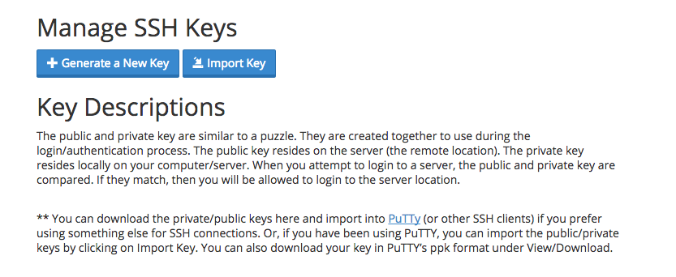
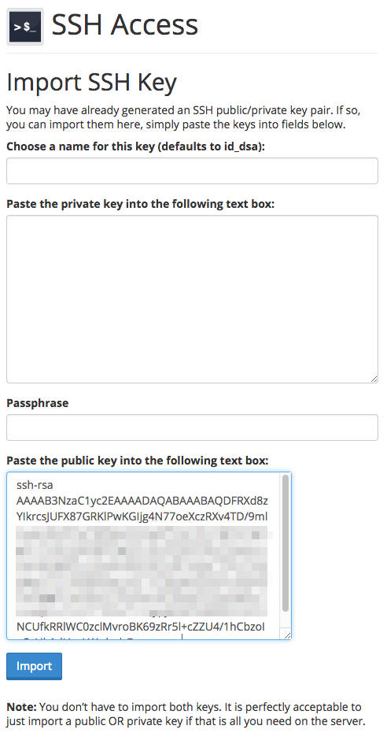
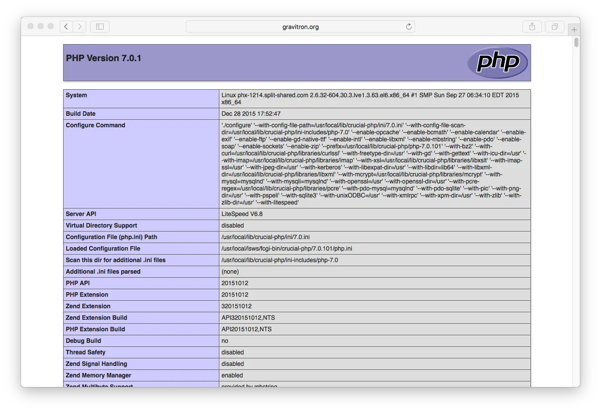

> [!訳注]  
> このページは、内容的に日本のサービスではないので、日本の方で、このページを読む人はほとんどいないと思いますが、以下の内容は PHP バージョンの話などから類推するにかなり古い内容であり、もし読む必要がある場合でも、適宜読み替えながら読んでください。

[Crucial Web Hosting](http://www.crucialwebhost.com/promo/1421086/) は、新しい種類の現代的な web ホスティングプラットフォームで、スピードとサポートに力を入れています。 **SSD ドライブ** と **Litespeed** web サーバーを最新の **Intel XEON プロセッサ** で使用することで、 Grav のパフォーマンスは素晴らしいものになります。 Crucial は、最新リリースの PHP 7.0 を提供しています。


このガイドでは、 **Tier-1 Split-Shared** ホスティングパッケージを設定しながら、 Grav を最適化して動かすための概要を解説します。

<h2 id="picking-your-hosting-plan">ホスティングプランを決める</h2>

[Crucial Web Hosting](http://www.crucialwebhost.com/promo/1421086/) には、2つの主要なオプションがあります。 **Spit-Shared** と、 **Split-Dedicated** ホスティングです。Crucial によれば、これらのクラウドベースのオプションは、これまでのホスティングセットアップよりも優れており、より独立した、より良いパフォーマンスを提供します。

Split-Shared ホスティングは、月額 $10 から $100 で、メモリーと SSD 容量で決まります。 Split Dedicated は、月額 $150 から $650 で、コアの数、メモリー、SSD 容量、そして帯域幅により決まります。今回は、ベースラインの月額 $10 オプションを使って、メモリー 266MB 及び SSD 容量 10GB とします。

<h2 id="enabling-ssh">SSHを有効化</h2>

まず、 cPanel の **Security** セクションにある **Toggle SSH Access** オプションを開いてください。この SSH アクセスページで、 **Enable SSH Access** ボタンをクリックします。

それから、 **Security Section** に戻り、 **Manage SSH Keys** オプションをクリックします。



ここで、2つの選択肢があります。 **新しい鍵を生成するか** もしくは **鍵をインポートするか** です。公開・秘密鍵のペアをローカルコンピュータで作成し、 DSA パブリックキーをインポートする方が簡単です。

> [!Info]  
> Windows ユーザーは、多くの便利な GNU と Mac や Linux プラットフォームで使える便利なツールを提供するため、まず [Cygwin](https://www.cygwin.com/) のインストールが必要です。パッケージ選択プロンプトでは、 SSH オプションに確実にチェックを入れてください。インストール後、 `Cygwin Terminal` を立ち上げてください。

ターミナルウインドウを立ち上げ、次のようにタイプしてください：

```bash
ssh-keygen -t dsa
```

この鍵の生成スクリプトは、いくつかの値を入力させるプロンプトを表示します。デフォルト値を許容できる場合は、 `[return]` キーを押すだけでも良いです。このスクリプトは、ホームディレクトリの `.ssh/` というフォルダに、 `id_dsa` （秘密鍵）と、 `id_dsa.pub` （公開鍵）を作成します。プライベートキーを与えたり、どこかにアップロードするようなことは **決してしないでください** 。してよいのは、 **公開鍵だけです** 。

> [!訳注]  
> dsa でのキー生成は、2025年現在では、安全とは言えないような気もします。安全なキー生成の方法を調べてください。

鍵を生成できたら、 **SSH Access** ページの **Import SSH key** セクションで、 `Public Key` 入力欄に `id_dsa.pub` パブリックキーの中身を貼り付けできます：



アップロード後、 SSH 鍵管理ページの **Public Keys** セクションで鍵のリストを確認してください。それから、 **Manage** をクリックする必要があります。そのキーが認証されたことが確認されます：


これで、サーバーに SSH テストする準備ができました。

```bash
ssh crucial_username@crucial_servername
```

言うまでもなく、 `crucial_username` には Crucial から提供されているユーザー名を、 `crucial_servername` には Crucial から提供されているサーバー名を入力する必要があります。

<h2 id="configuring-php">PHP の設定</h2>

現在の Crucial Web Hosting のデフォルトは **PHP 5.3** で、Grav の最低要件を満たしていません。幸運なことに、 Crucial では、最新の **PHP 7.0** までサポートしています。より新しいものに PHP バージョンを上げましょう。

これを行うには、 web ルートにある `.htaccess` ファイルに特別なハンドラの呼び出しを追記する必要があります。 `~/www/.htaccess` ファイルを作成し、以下を入力してください：

```bash
AddHandler application/x-httpd-php70 .php
```

ファイルを保存してください。 **現在の PHP バージョン** を確認するために、一時ファイルの `~/www/info.php` ファイルを作成し、次の内容を入力してください：

```php
<?php phpinfo();
```

ファイルを保存し、ブラウザでサイト内のこの info.php ファイルを表示してください。すると、先ほど選択したバージョンが反映さｓれた PHP 情報が表示されるはずです：



> [!Info]  
> もし Grav をホスティングアカウントのルートディレクトリにインストールしている場合、 **Add Handler** メソッドを Grav から提供されているトップの `.htaccess` ファイルに追記する必要があります。

> [!Tip]  
> Grav を実行するときに別の PHP バージョンを選択できます。たとえば PHP 5.6 を `x-httpd-php56` によって選択できます。

<h2 id="setup-cli-php">CLI PHP のセットアップ</h2>

このドキュメントを書いている時点では、 Crucial のデフォルト PHP バージョンは **5.3** です。 Grav は PHP **5.5 以上** を必要とするため、 Grav がコマンドライン（ CLI ）で新しい PHP バージョンを使えるようにする必要があります。そのためには、 SSH でサーバーにアクセスし、新しいシンボリックリンクをあなたのユーザーの `bin/` フォルダ内の新しい PHP バージョンに作成してください：

```bash
ln -s /usr/local/bin/php-70 ~/bin/php
```

次に、 `.bash_profile` ファイルを編集し、 `$HOME/bin` リファレンスを通常の `$PATH` 文字列の前に追加してください：

```txt
# .bash_profile

# Get the aliases and functions
if [ -f ~/.bashrc ]; then
        . ~/.bashrc
fi

# User specific environment and startup programs

PATH=$HOME/bin:$PATH

export PATH
```

プロファイル _source_ が必要です： `$ source ~/.bash_profile` もしくは、ターミナルに再ログインし、パスの変更が反映されるようにします。それが終わったら、 `php -v` を入力し、確認してください：

```bash
php -v
PHP 7.0.1 (cli) (built: Dec 28 2015 17:55:36) ( NTS )
Copyright (c) 1997-2015 The PHP Group
Zend Engine v3.0.0, Copyright (c) 1998-2015 Zend Technologies
    with Zend OPcache v7.0.6-dev, Copyright (c) 1999-2015, by Zend Technologies
```

<h2 id="install-and-test-grav">Grav のインストールとテスト</h2>

新しい SSH 機能を使って、（まだ未接続であれば） Crucial サーバーに SSH 接続し、最新バージョンの Grav をダウンロードし、展開し、テストしてみましょう！

`/grav` サブフォルダに Grav を展開しましょう。 Grav に直接アクセス可能にするなら、 `~/www/` フォルダのルートに直接 unzip できます。

```bash
cd ~/www
wget --no-check-certificate https://getgrav.org/download/core/grav/latest
unzip grav-v{{ grav_version }}.zip
```

これで、ブラウザで `http://mywirenineserver.com/grav` などが表示できるはずです。もちろん、適切な URL にしてください。

ここまでの解説のとおりに進めていただきましたので、 [Grav CLI](../../../07.cli-console/02.grav-cli/) や [Grav GPM](../../../07.cli-console/04.grav-cli-gpm/) コマンドも、利用可能です。次のように：

```bash
cd ~/public_html/grav
bin/grav clear-cache

Clearing cache

Cleared:  cache/twig/*
Cleared:  cache/doctrine/*
Cleared:  cache/compiled/*
Cleared:  cache/validated-*
Cleared:  images/*
Cleared:  assets/*

Touched: /home/your_user/public_html/grav/user/config/system.yaml
```

