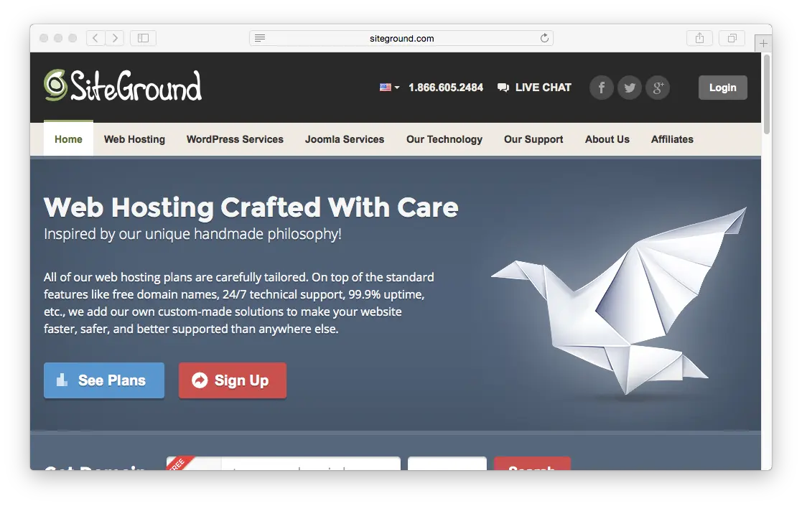
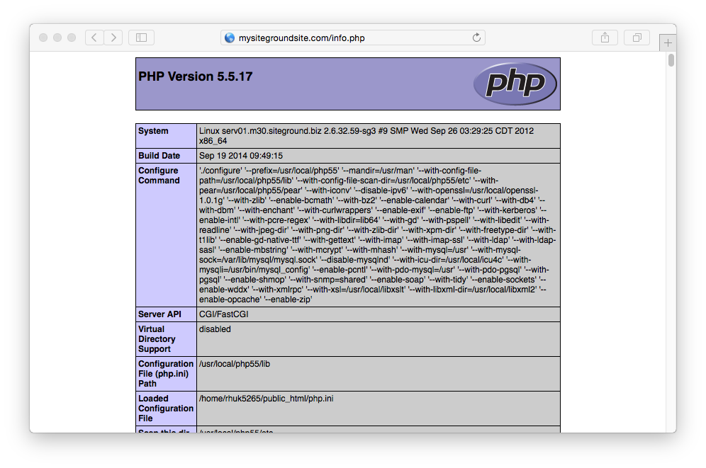
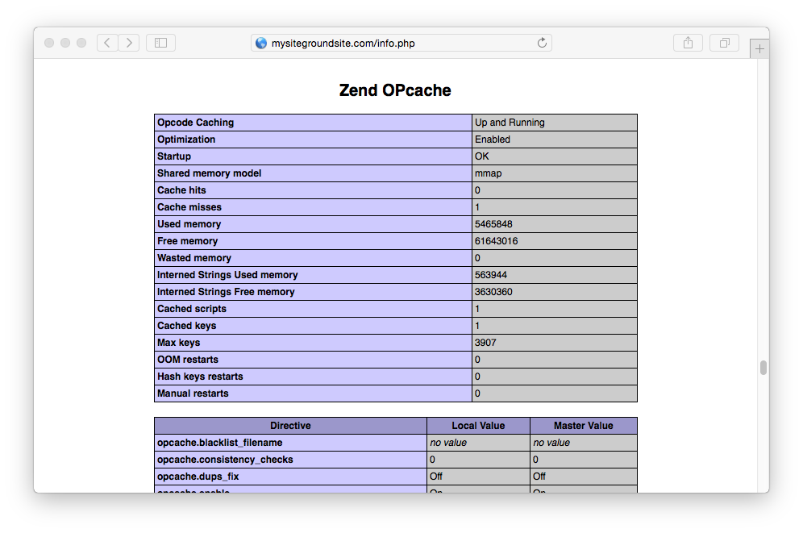

> [!訳注]  
> このページは、内容的に日本のサービスではないので、日本の方で、このページを読む人はほとんどいないと思いますが、以下の内容は PHP バージョンの話などから類推するにかなり古い内容であり、もし読む必要がある場合でも、適宜読み替えながら読んでください。

[SiteGround](http://www.siteground.com/) のキャッチコピーは、 **Web Hosting Crafted With Care(ケアのあるウェブホスティング)** です。Joomla や WordPress コミュニティの人々から人気のあるレンタルサーバーであることが保証されています。 Grav ベースの web サイトをホスティングするのにも良い選択肢です。



このガイドでは、標準的な SiteGround シェアホスティングアカウントでの Grav の最適化方法の概要を解説します。

<h2 id="picking-your-hosting-plan">ホスティングプランを決める</h2>

このドキュメントを書いている時点では、 SiteGround には [3つのホスティングオプション](http://www.siteground.com/web-hosting.htm) があり、ローエンドで月額 $3.95 から $14.95 の **GoGeek** プランまであります。ハイエンドなのに十分に安い **GoGeek** プランが特におすすめです。このプランはより良いサーバーハードウェアを提供し、サーバーでの _ユーザーの混雑_ を減らします。

<h2 id="configuring">設定</h2>

SiteGround では、コントロールパネルとして **cPanel** のフル機能を提供しています。これは、 **My Accounts** タブから直接アクセス可能です。

<h2 id="enabling-ssh">SSH を有効化</h2>

まず、 cPanel の **ADVANCED** セクションにある **SSH/Shell Access** オプションを開きます。

SiteGround では、 [SSH の使い方チュートリアル](http://www.siteground.com/tutorials/ssh/) が提供されていますが、公開・秘密鍵をあなたのローカルコンピュータで作成し、 DSA 公開鍵をアップロードする方が簡単です。

> [!Info]  
> Windows ユーザーは、多くの便利な GNU と Mac や Linux プラットフォームで使える便利なツールを提供するため、まず [Cygwin](https://www.cygwin.com/) のインストールが必要です。パッケージ選択プロンプトでは、 SSH オプションに確実にチェックを入れてください。インストール後、 `Cygwin Terminal` を立ち上げてください。

ターミナルウインドウを立ち上げ、次のようにタイプしてください：

```bash
$ ssh-keygen -t dsa
```

この鍵の生成スクリプトは、いくつかの値を入力させるプロンプトを表示します。デフォルト値を許容できる場合は、 `[return]` キーを押すだけでも良いです。このスクリプトは、ホームディレクトリの `.ssh/` というフォルダに、 `id_dsa` （秘密鍵）と、 `id_dsa.pub` （公開鍵）を作成します。秘密鍵を与えたり、どこかにアップロードするようなことは **決してしないでください** 。してよいのは、 **公開鍵だけです** 。

> [!訳注]  
> dsa でのキー生成は、2025年現在では、安全とは言えないような気もします。安全なキー生成の方法を調べてください。

一度生成されたら、 `id_dsa.pub` 公開鍵のコンテンツを **SSH/Shell Access** ページの **Upload SSH key** セクションにある `Public Key` 入力欄にペーストできます：


アップロード後、このページの下にあるキー一覧を確認してください。これによりサーバーに SSH 接続する準備ができました。

```bash
$ ssh siteground_username@siteground_servername -p18765
```

言うまでもなく、 `siteground_username` には SiteGround から提供されているユーザー名を、 `siteground_servername` には SiteGround から提供されているサーバー名を入力する必要があります。 `-p18765` は、 SiteGround の SSH 実行ポートが非標準なので、必要です。

<h2 id="enabling-php-opcache">PHP OPcache を有効化</h2>

> [!Tip]  
> アップデート [2016-03]: SiteGround サポートによると、 OPCache は PHP 7 から利用可能であり、5.5 ではできないようです。 OPCache はデフォルトで有効化され、それ以上の設定はセットアップ時に不要です。よって、以下の解説の一部は、もはや不要となりました。

デフォルトでは、 SiteGroud では **Zend OPcache** を **サポート** しますが、 **有効化はされていません** 。手動で有効化する必要があります。 `php.ini` ファイルを `public_html/` フォルダに作成し、以下のコンテンツを入力してください：

```txt
zend_extension=opcache.so
```

現在の PHP バージョンを確認し、 Zend OPcache が実行されているかをテストするため、一時ファイルを作ります： `public_html/info.php` そして次のコンテンツを入力してください：

```php
<?php phpinfo();
```

ファイルを保存し、ブラウザでサイト上のこの info.php を表示させると、先ほど選択したバージョンを反映した PHP 情報が表示されます：



下へスクロールして、 **Zend OPcache** セクションを確認してください：



<h2 id="install-and-test-grav">Grav のインストールとテスト</h2>

新しい SSH 機能で、（もし未接続であれば） SiteGround サーバーに SSH 接続し、最新バージョンの Grav をダウンロードし、 unzip し、テストしてみましょう！

ここでは `/grav` サブフォルダに Grav を展開します。 Grav に直接アクセスするには `~/public_html/` フォルダのルートに直接 unzip することもができます。

```bash
$ cd ~/public_html
[~/public_html]$ curl -L -O https://github.com/getgrav/grav/releases/download/{{ grav_version }}/grav-v{{ grav_version}}.zip
[~/public_html]$ unzip grav-v{{ grav_version}}.zip
```

これで、 `http://mysiteground.com/grav` をブラウザ表示できます。もちろん、適切な URL に修正してください。

> [!Tip]  
> アップデート [2016-03]: SiteGround レンタルサーバーの PHP 7 への CLI パスは、現時点で `/usr/local/php70/bin/php-cli` であり、 gpm/grav をコマンドラインから使うためには、エイリアスを作成し、それをたーいなるから直接 php-cli を参照するようにできます。たとえば： `alias php-cli="/usr/local/php70/bin/php-cli"` 。その後、次のように使えます： `$php-cli bin/grav list`


ここまでの解説の通りに進めていただきましたので、 [Grav CLI](../../../07.cli-console/02.grav-cli/) や [Grav GPM](../../../07.cli-console/04.grav-cli-gpm/) も利用可能となります：

```bash
$ cd ~/public_html/grav
$ bin/grav clear-cache

Clearing cache

Cleared:  cache/twig/*
Cleared:  cache/doctrine/*
Cleared:  cache/compiled/*
Cleared:  cache/validated-*
Cleared:  images/*
Cleared:  assets/*

Touched: /home/your_user/public_html/grav/user/config/system.yaml
```

In order to use the Grav package manager (gpm) you'll have to set it as an executable by running this command in your Grav folder

```bash
$ chmod +x bin/gpm
```

