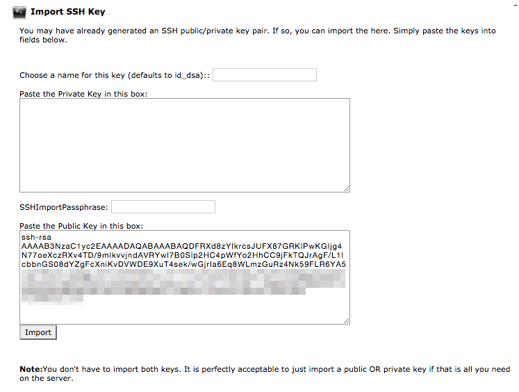

> [!訳注]  
> このページは、内容的に日本のサービスではないので、日本の方で、このページを読む人はほとんどいないと思いますが、以下の内容は PHP バージョンの話などから類推するにかなり古い内容であり、もし読む必要がある場合でも、適宜読み替えながら読んでください。

[Arvixe](http://www.arvixe.com) は、受賞歴のあるホスティング会社で、高品質な web ホスティングを **手頃に** かつ **高い信頼性で** 提供していることに誇りを持っています。高いな機能性と **開発者に親切な** スタンスのため、 Arvixe レンタルサーバーは、 Grav ベースのサイトにとって素晴らしい選択肢です。


このガイドでは： Arvixe レンタルサーバーの標準的なアカウントで Grav を最適化して動かす方法の概要を解説します。

<h2 id="picking-your-hosting-plan">ホスティングプランを決める</h2>

このドキュメントを書いている時点では、 Arvixe には [2つの Linux ベースのホスティングオプション](http://www.arvixe.com/linux_web_hosting) があり、コストは月額 $4.00 の **PersonalClass** と、月額 $7.00 の **PersonalClass Pro** プランがあります。どちらのプランも、ほとんど同じですが、 Pro プランの場合ドメイン制限がありません。どちらでも Grav は良く機能します。

<h2 id="configuring-php">PHP 設定</h2>

Arvixe では、コントロールパネルとして **cPanel** のフル機能を提供しています。その URL は、 welcom email に掲載されています。

Arvixe のデフォルト PHP バージョンは **5.3** なので、最初にやるべきは、サイトで実行されるデフォルトの PHP バージョンを変更することです。

cPanel のメインホームページ上で、 **Software/Services** というセクションがあります。ここに **ntPHPSelector** が見つかるでしょう。これをクリックすると、フォルダツリーが表示されます。そこでは、特定のフォルダを設定するか、 `public_html` をクリックすることでサイト全体のバージョンを設定できます。フォルダを選択すると、 PHP のバージョンを選択できるので、 **5.5** を選択し、送信をクリックしてください。


反映させるため、 **Save** をクリックしてください。

あなたの web サイト URL の最後に `phpinfo.php` を付けてサイトにアクセスしてください。たとえば： `http://myarvixe.com/phpinfo.php`


正しい PHP バージョンで実行しているか確認できます。

> [!Info]  
> Arvixe の PHP 5.5 ではすでに Zend OPcache が有効化されています。よってこのセットアップで必要な手順はここまでです。

<h2 id="enabling-ssh">SSH を有効化</h2>

まず、 cPanel の **Security** セクションにある **SSH/Shell Access** オプションを開いてください。この SSH アクセスページで、 **Manage SSH Keys** ボタンをクリックします。

この時、2つの選択肢があります。 **新しい鍵を生成** するか **鍵をインポート** するかです。公開・秘密鍵のペアをローカルコンピュータで作成し、 DSA パブリックキーをインポートするだけの方が簡単です。

> [!Info]  
> Windows ユーザーは、多くの便利な GNU と Mac や Linux プラットフォームで使える便利なツールを提供するため、まず [Cygwin](https://www.cygwin.com/) のインストールが必要です。パッケージ選択プロンプトでは、 SSH オプションに確実にチェックを入れてください。インストール後、 `Cygwin Terminal` を立ち上げてください。

ターミナルウインドウを立ち上げ、次のようにタイプしてください：

```bash
$ ssh-keygen -t dsa
```

この鍵の生成スクリプトは、いくつかの値を入力させるプロンプトを表示します。デフォルト値を許容できる場合は、 `[return]` キーを押すだけでも良いです。このスクリプトは、ホームディレクトリの `.ssh/` というフォルダに、 `id_dsa` （秘密鍵）と、 `id_dsa.pub` （公開鍵）を作成します。プライベートキーを与えたり、どこかにアップロードするようなことは **決してしないでください** 。してよいのは、 **公開鍵だけです** 。

> [!訳注]  
> dsa でのキー生成は、2025年現在では、安全とは言えないような気もします。安全なキー生成の方法を調べてください。

鍵を生成できたら、 **SSH Access** ページの **Import SSH key** セクションで、 `Public Key` 入力欄に `id_dsa.pub` パブリックキーの中身を貼り付けできます：



アップロード後、 SSH キー管理ページの **Public Keys** セクションにあるキー一覧を確認してください。鍵が認証されていることを確認するため、 **Manage** をクリックする必要があります：


これで、サーバーに SSH テストする準備ができました。

```bash
$ ssh arvixe_username@arvixe_servername
```

言うまでもなく、 `arvixe_username` には Arvixe から提供されているユーザー名を、 `arvixe_servername` には Arvixe から提供されているサーバー名を入力する必要があります。

<h2 id="setup-cli-php">CLI の PHP を設定</h2>

このドキュメントを書いている時点では、 Arvixe のデフォルト PHP バージョンは **5.3** です。 Grav は **5.5+** が必要なので、 Grav がコマンドライン(CLI)でも PHP の新しいバージョンを使えるようにしなければいけません。これを実現するには、サーバーに SSH 接続し、 `.bash_profile` ファイルを編集して、標準のパスよりも前に適切な PHP パスを参照するように変更してください：

```bash
# .bash_profile

# Get the aliases and functions
if [ -f ~/.bashrc ]; then
        . ~/.bashrc
fi

# User specific environment and startup programs

PATH=/opt/ntphp/php55/bin:$PATH:$HOME/bin

export PATH
```

プロファイル _source_ が必要です： `$ source ~/.bash_profile` もしくは、ターミナルに再ログインし、パスの変更が反映されるようにします。それが終わったら、 `php -v` を入力し、確認してください：

```bash
$ php -v
PHP 5.5.18 (cli) (built: Nov 19 2014 14:29:20)
Copyright (c) 1997-2014 The PHP Group
Zend Engine v2.5.0, Copyright (c) 1998-2014 Zend Technologies
    with Zend OPcache v7.0.4-dev, Copyright (c) 1999-2014, by Zend Technologies
```

<h2 id="install-and-test-grav">Grav のインストールとテスト</h2>

SSH 機能が使えるようになったので、もし未接続であれば Arvixe サーバーに SSH 接続し、最新バージョンの Grav をダウンロードし、 unzip し、テストしてみましょう！

サブフォルダの `/grav` に Grav を展開しますが、 Grav が直接アクセスできるようにするには、 `~/public_html/` フォルダのうr−とに直接 unzip することもできます。

```bash
$ cd ~/public_html
[~/public_html]$ curl -L -O https://github.com/getgrav/grav/releases/download/{{ grav_version }}/grav-v{{ grav_version}}.zip
[~/public_html]$ unzip grav-v{{ grav_version}}.zip
```

これで、ブラウザで `http://mywirenineserver.com/grav` などが表示できるはずです。もちろん、適切な URL にしてください。

ここまでの解説のとおりに進めていただきましたので、 [Grav CLI](../../../07.cli-console/02.grav-cli/) や [Grav GPM](../../../07.cli-console/04.grav-cli-gpm/) コマンドも、利用可能です。次のように：

```bash
$ cd ~/public_html/grav
$ bin/grav clear-cache

Clearing cache

Cleared:  cache/twig/*
Cleared:  cache/doctrine/*
Cleared:  cache/compiled/*
Cleared:  cache/validated-*
Cleared:  images/*
Cleared:  assets/*

Touched: /home/your_user/public_html/grav/user/config/system.yaml
```

