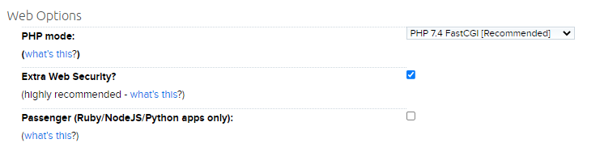
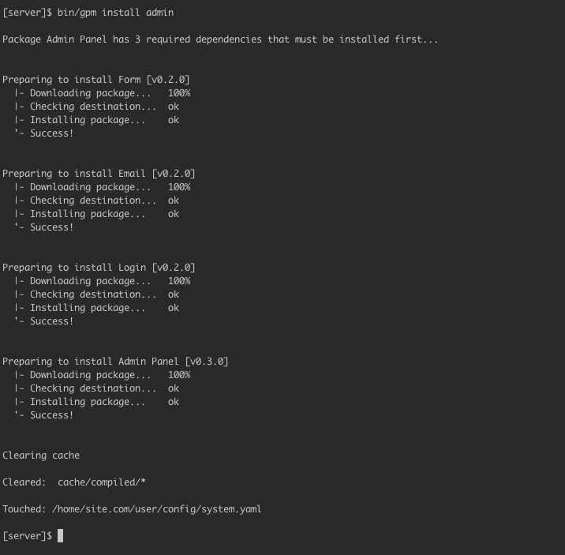

> [!訳注]  
> このページの内容は、日本向けのサービスではないため、日本の方が読む機会はほとんどないと思います。また、 PHP のバージョンなどから判断して、かなり古い情報が書かれているようです。もし読む必要がある場合は、古い情報であることを理解したうえで、適宜読み替えてください。

[Dreamhost](http://dreamhost.com) は、有名なホスティングプロバイダで、 SSD によるレンタルサーバー事業から、専用サーバーまで、幅広いサービスを提供しています。


レンタルサーバーの低いサービスに注目しましょう。素晴らしい管理パネルが付いていますが、一般的な cPanel ではありません。しかし利用可能なカスタムパネルは、 SSH ユーザーの管理から実行 PHP のバージョンまであらゆる設定が可能です。

<h2 id="configuring-php">PHP の設定</h2>

すべての（サブ）ドメインごとに PHP バージョンを設定可能です。このドキュメントを書いている時点では、デフォルトの PHP バージョンは 7.4 です。新しいバージョンを選択することも可能です（8.0 が利用可能）。そして、 Grav のシステム要件である 7.3.6 以上にすることをおすすめします。



<h2 id="enabling-ssh">SSH を有効化</h2>

Users パネルを開いてください。 Dreamhost ユーザーはすべて、異なるアクセスレベルを持つことができます。あなたのユーザーアカウントに、 Shell User を設定してください。

このドキュメントを書いている時点で、デフォルトの PHP CLI バージョンは 8.0.8 です。よって、 Grav の CLI ツールが適切に動かすためにすることは特にありません。

<h2 id="install-and-test-grav">Grav のインストールとテスト</h2>

新しいドメインを追加したときは、 Dreamhost では、あなたのアカウントのフォルダの下に、それ用のフォルダが作成されます。

SSH を使ってサーバーにアクセスし、そのフォルダに移動してください。そこで、 Grav をダウンロードします：

```bash
wget https://github.com/getgrav/grav/releases/download/{{ grav_version }}/grav-v{{ grav_version}}.zip
```

（最新バージョンが利用可能か [チェックしてください](https://github.com/getgrav/grav/releases/) ）

unzip してください： `unzip grav-v{{ grav_version }}.zip` 。これにより、 `grav` フォルダが作成されるので、現在のフォルダにファイルを移動する必要があります。次のように：
Just type:

```bash
mv grav/* grav/.htaccess ./; rmdir grav
```

ここで、 zip ファイルは削除可能です：

```bash
rm grav-v{{ grav_version }}.zip
```

Grav はインストール成功しました。ブラウザからアクセスしてみてください。Grav のウェルカムページが表示されるはずです。

プラグインやテーマも、インストール可能になっています。たとえば、次のようにして Grav の管理パネルプラグインをインストールできます：

```bash
bin/gpm install admin
```



<h2 id="enable-opcache">OPCache を有効化</h2>

<h3 id="on-dreamhost-shared-hosting-plans">Dreamhost レンタルサーバーのプランの場合</h3>

OPCache はデフォルトで有効です。

<h3 id="on-dreamhost-vps-plans">Dreamhost VPS プランの場合</h3>

OPCache はサポートされていますが、デフォルトでは有効になっていません。手動で有効化する必要があります。 phprc ファイルをユーザーフォルダの下の `.php/7.4/phprc` に作成してください（数字は、お使いの PHP バージョンに合わせてください）。このファイルで、以下のコードを書き込んでください：

```txt
zend_extension=opcache.so
```

必要に応じて、このファイルで OPCache のさらなるカスタマイズが可能です。

