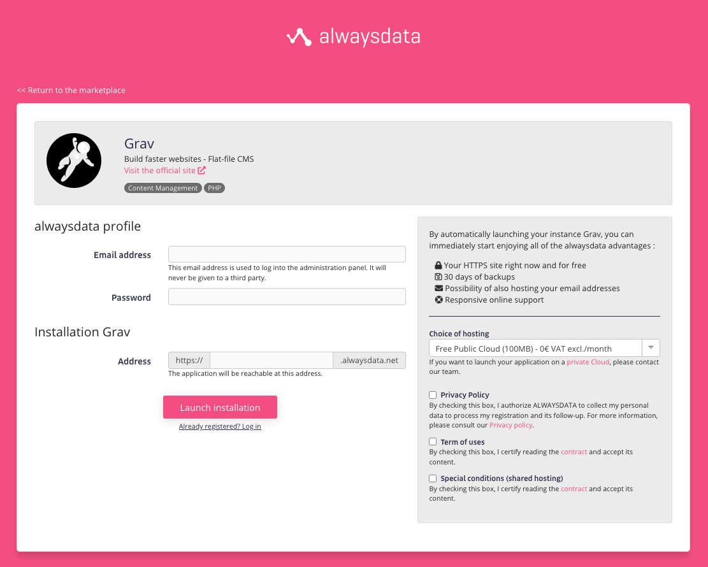
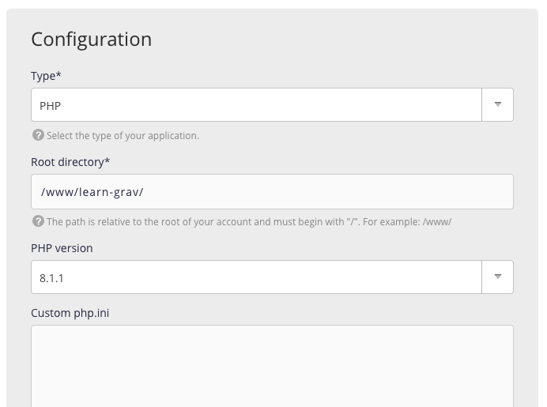

[alwaysdata](https://www.alwaysdata.com) は、ヨーロッパのレンタルサーバー会社で、レンタルサーバーや専用管理サーバーで異なるプランを提供しています。自動バックアップや、無料 SSL 認証、 SSH アクセスなど、たくさんのクールな機能が含まれます。

**無料レンタルサーバープラン** は、100MB 以下のディスク容量で利用可能です。そうでなければ、月額 8ユーロからのプランがあります。

<h2 id="install-grav-from-marketplace">マーケットプレイスから Grav をインストール</h2>

パブリックの [マーケットプレイス](https://www.alwaysdata.com/en/marketplace/) で Grav を含むたくさんのアプリケーションが提供されています。わずかな情報を提供するだけで、 **無料プラン** で、 **バックアップ込み** の (HTTPS) を**即座に利用可能** となります。

<h2 id="customizing-php">PHP のカスタマイズ</h2>

PHP を設定するため、サイトインスタンスをパーソナルにできます。 alwaysdata が提供するカスタムパネルで PHP バージョンと *php.ini* を調整してください。

[PHP 拡張](https://help.alwaysdata.com/en/languages/php/extensions/) に関する alwaysdata 社のドキュメントを読む限り、OPCache はデフォルトで有効です。

<h2 id="configure-ssh-access">SSH アクセスの設定</h2>

SSH はデフォルトでは無効化されているので、より深くアクセスするには、 [SSH アクセスを有効化](https://help.alwaysdata.com/en/remote-access/ssh/) する必要があります。もう一度、パネルで実行してください。

