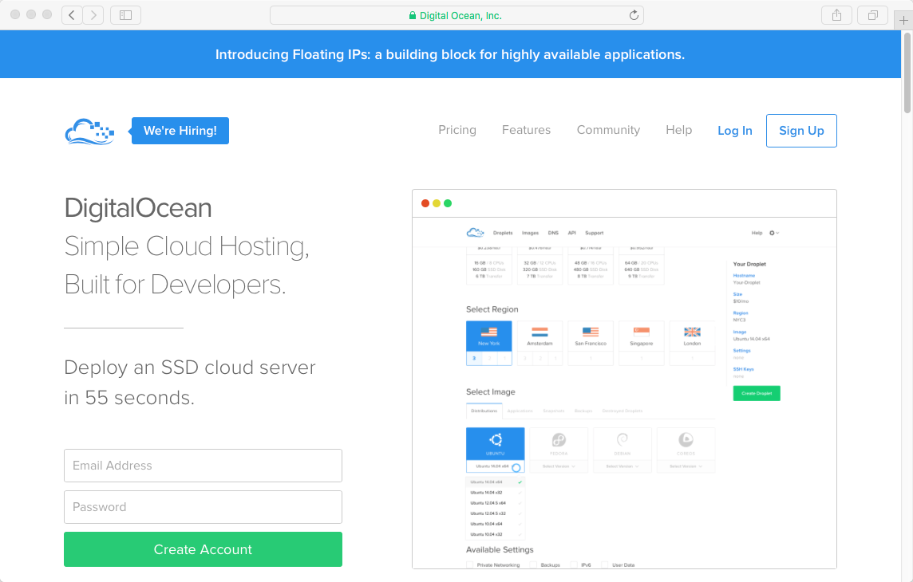
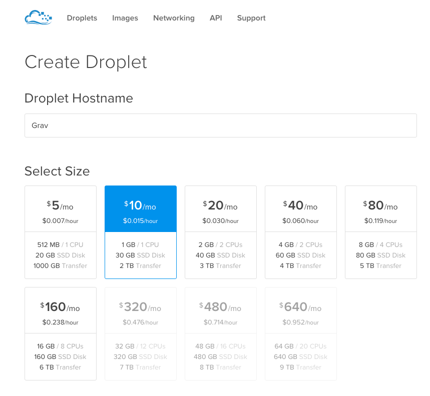
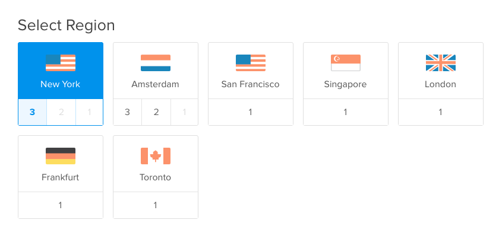
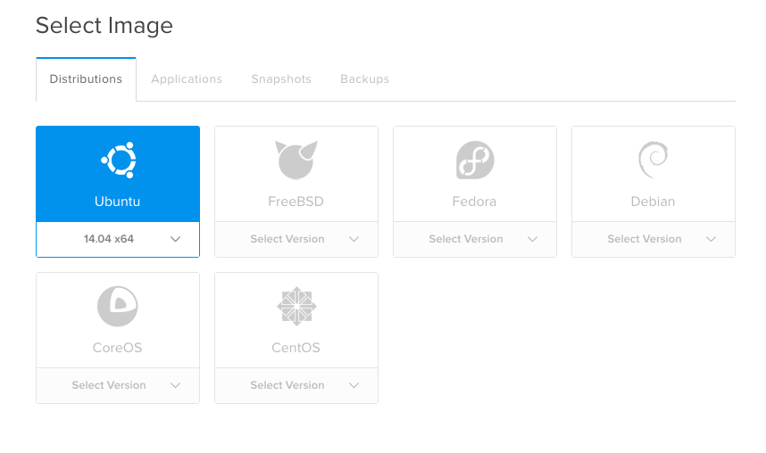
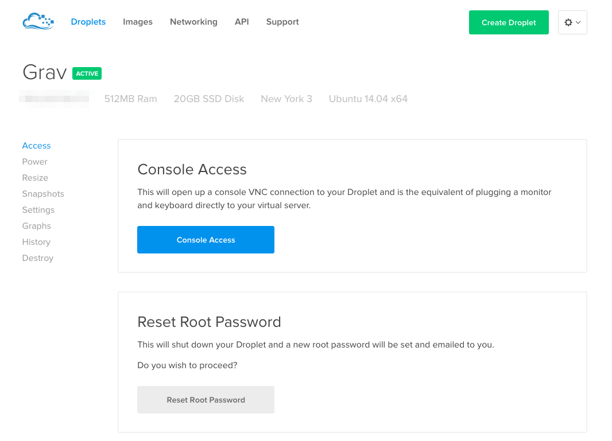

> [!訳注]  
> このページは、内容的に日本のサービスではないので、日本の方で、このページを読む人はほとんどいないと思いますが、以下の内容は Ubuntu バージョンの話などから類推するにかなり古い内容であり、もし読む必要がある場合でも、適宜読み替えながら読んでください。

もしかすると、すべての VPS プロバイダで最も人気で、最も幅広く使われているであろう [DigitalOcean](https://www.digitalocean.com/) は、 VPS オプションを提供しています。 **月額 $5 で 1CPU, 1024MB システム** から、 月額 $960 で 32 CPU, 192 GB のセットアップまであり、 [DigitalOcean](https://www.digitalocean.com/) はあなたとともにスケールするソリューションを持っています。すべてのサーバーは **RAID SSD ドライブ**, **モダンな 6-core ハードウェア**, **KVM 仮想化**, そして信頼できる **Tier-1 帯域幅** でビルドされており、最大限のパフォーマンスを約束します。 Grav ベースのサイトをホスティングするには、すばらしいオプションです。

アカウントを作成し、クレジットをデポジットすると、始められます。 DigitalOcean は **Droplets** という VPS インスタンスをあらわすものを作成できます。コントロールパネルの **Create Droplet** ボタンをクリックし、フォームに入力するだけです：

あなたの Droplet のシンプルな名前を入力し、値段と必要なサーバに応じて **サイズを選んでください** Grav は、どんな設定でもよく動きます。月額 $5 のオプションであっても、迅速かつ効率的に動きます。

次に、 VPS が置かれる **リージョンを選択してください** あなたのサービス利用者が利用しやすい場所が最適です。サーバが開発目的のみであれば、あなたに一番近い場所を選んでください。

最後に、インストールするイメージを選択する必要があります。 DigitalOcean は、幅広い選択肢の Linux ディストリビューションや、完全なアプリケーション、そして以前保存したスナップショットから選択できるようになっています。このガイドの目的からすると、最新の **Ubuntu 18.04 LTS** をインストールしましょう。とても人気で、サポートも手厚いものです。

他のオプションはデフォルトにできます。 **Create Droplet** をクリックすると Droplet は 55 秒以内に作成され、 Droplet の一覧に表示されます。ルートパスワードとともに email を受信してください。先ほど作成した Droplet をクリックすると、たくさんのオプションが表示されます。

Droplet マネージャーにある **Access** タブから、インスタンスに素早くログオンできます。しかし、 SSH 接続を利用する方が、より便利に使えます。公開鍵認証が推奨されており、 DigitalOcean は素晴らしい [SSH 公開鍵認証のドキュメント](https://www.digitalocean.com/community/tutorials/how-to-use-ssh-keys-with-digitalocean-droplets) を提供しているので、順番に手順を追ってください。

---

[plugin:content-inject](../05.ubuntu-18.04/)

