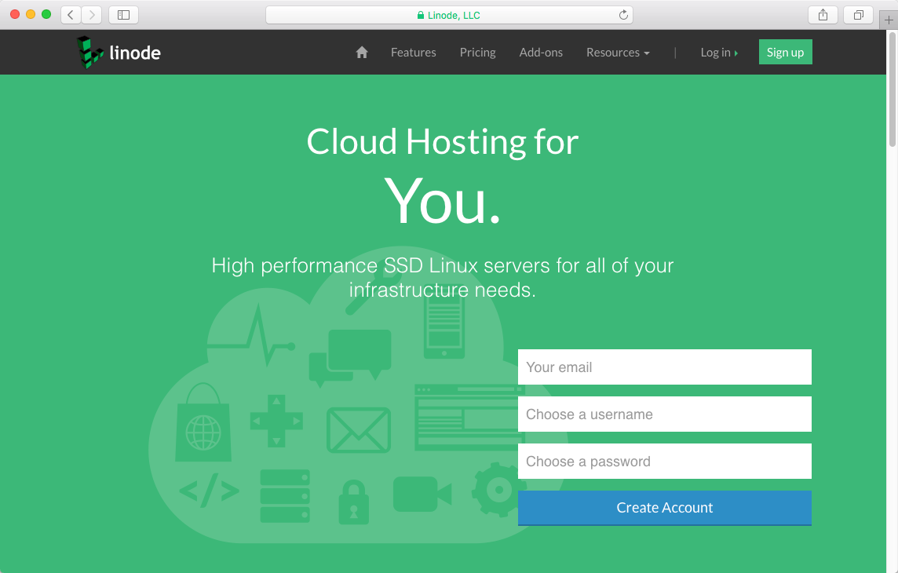
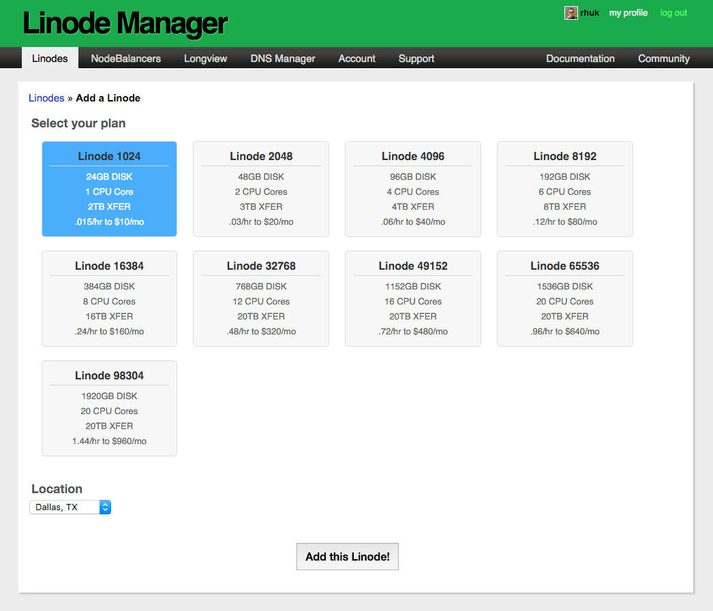
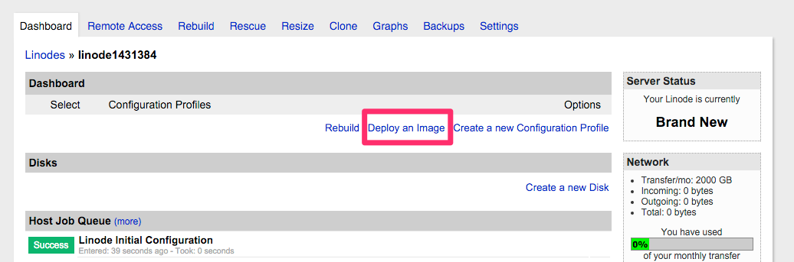
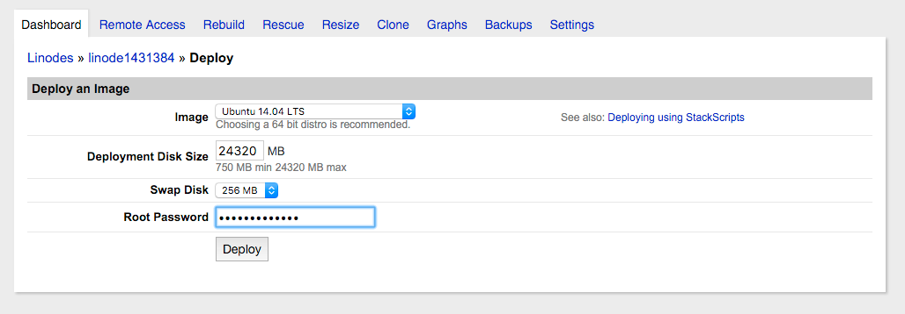
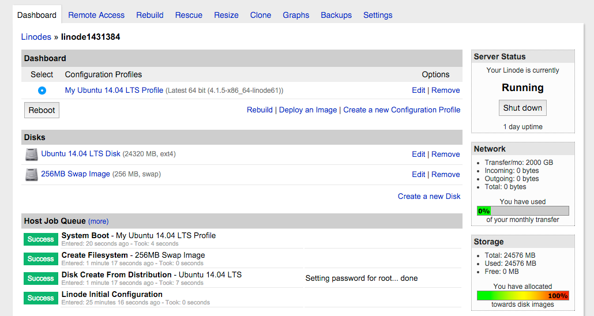

> [!訳注]  
> このページは、内容的に日本のサービスではないので、日本の方で、このページを読む人はほとんどいないと思いますが、以下の内容は Ubuntu バージョンの話などから類推するにかなり古い内容であり、もし読む必要がある場合でも、適宜読み替えながら読んでください。

[Linode](https://www.linode.com/?r=300c424631b602daaa0ecef22912c1c26c81e3af) は、 VPS ゲーム業界の老舗であり、 **高速の SSD 搭載 Linux サーバー** を提供することに集中しています。サーバの立ち上げて動かすのに、速く簡単な処理でできます。あなたに必要なベストの **プランの値段** を選び、 **Linus ディストリビューション** を選び、それから **node location** を選びます。

> [!Tip]  
> [Linode マーケットプレイスアプリ](https://www.linode.com/marketplace/apps/linode/grav/) を使うと、 [Linode の仮想プライベートサーバに直接 Grav をインストール](https://www.linode.com/docs/guides/grav-marketplace-app/) できるようになりました。

アカウントを作成し、 **Linode Manager** に移動した後、最初に Linode を追加する必要があります。このテストでは、最小で最安のオプションを選択します。月額 $10 で、1 CPU コア、 24GB SSD ディスク容量のものです。スケールするオプションはたくさんあります。最大 20 CPU コア、 2GB ディスクスペースです！また、投下先の適切なロケーションを選択することも忘れないでください：

Linode が作成されたら、オプションカラムにある **Dashboard** リンクをクリックしてください。これにより、あなたが選べるディストリビューションのページに移動します。ダッシュボードから、 **Deploy an Image** を選んでください。

互換性と使いやすさのため、 Ubuntu のステーブルディストリビューションを選びたいです。つまり **Ubuntu 18.04 LTS** です！残りはデフォルトとし、 **強いパスワード** を提供し、それからデプロイをクリックします：

サーバーの作成は、約 30 秒ででき、その後 **Boot** ボタンをクリックして起動・実行できるようになります。

Linode マネージャーの **Remote Access** タブをクリックして、今立ち上げた VPS インスタンスにリモート接続する方法に関係する情報が得られます。このタブで提供されるコマンドにより、ディストリビューションインスタンスを作成したときのパスワードを使って、 SSH 接続ができます。公開鍵認証が推奨されます。 Linode には良い [SSH 公開鍵認証のドキュメント](https://www.linode.com/docs/security/use-public-key-authentication-with-ssh?r=300c424631b602daaa0ecef22912c1c26c81e3af) があるので、必要な手順を踏んでください。

---

[plugin:content-inject](../05.ubuntu-18.04/)

