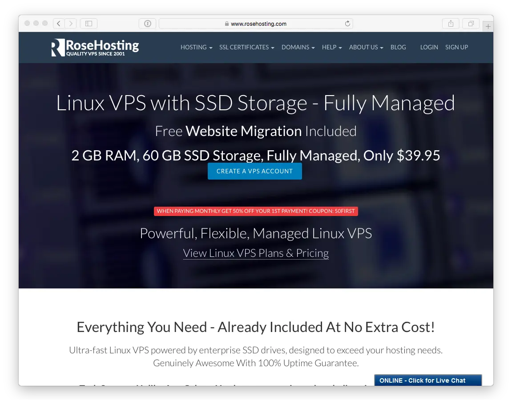
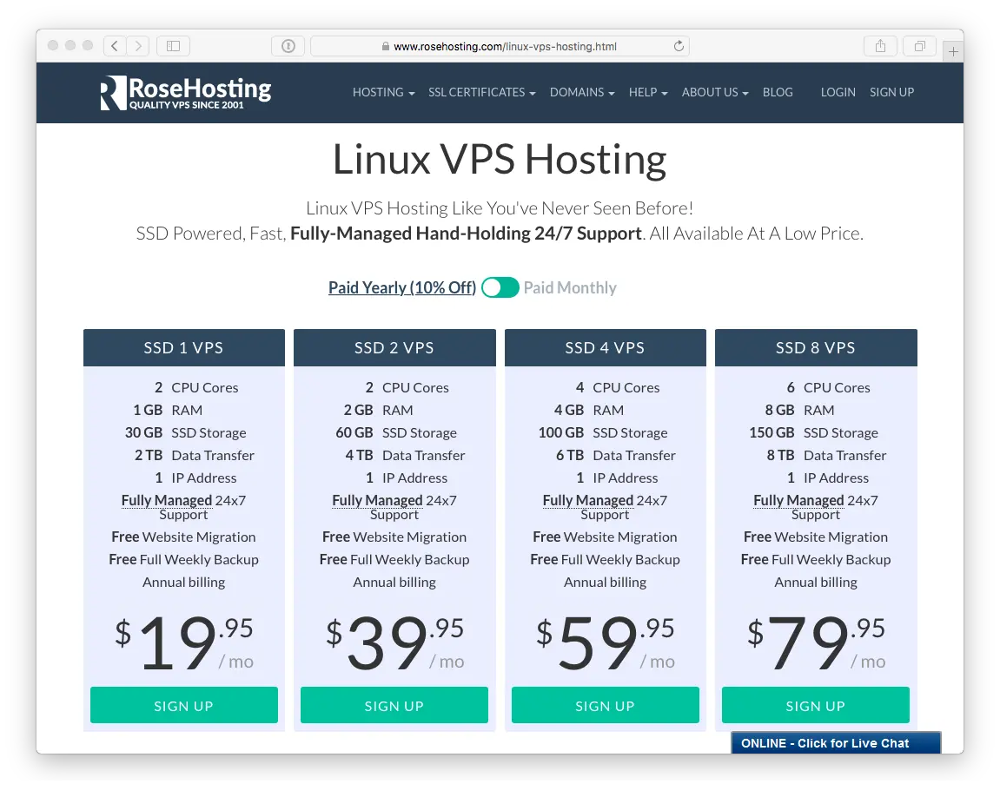

> [!訳注]  
> このページは、内容的に日本のサービスではないので、日本の方で、このページを読む人はほとんどいないと思いますが、以下の内容は Ubuntu バージョンの話などから類推するにかなり古い内容であり、もし読む必要がある場合でも、適宜読み替えながら読んでください。

かつて 2001 年には、 [RoseHosting](https://www.rosehosting.com) は、商用の Linux 仮想サーバを提供する世界最初にして唯一の会社でした。現在では、 Linux ホスティングパッケージを幅広く提供しています。 エンタープライズ向け **SSD ストレージ** による **Linux VPS** も含まれます。すべてのホスティングプランは、 **完全に管理** され、**24時間毎日無料サポート** が付属します。よって、自由に Grav をインストールし、セットアップできます。

[Linux VPS Hosting](https://www.rosehosting.com/linux-vps-hosting.html) ページに移動し、あなたの必要に最も合う **VPS ホスティングプランを選んでください** 。あなたの必要なだけのカスタム VPS を作成することさえできます。このガイドでは、最小プランである 'SSD 1 VPS' を利用します。

すでに持っているドメイン名情報か、もしくは新たに取得するものを入力し、 **Product Configuration** ページに移動して、支払いサイクルや使用 OS を選択できます。このガイドでは、 **Ubuntu 18.04 LTS** を使います。追加の DNS サービスを無料で取得でき、WHM/cPanel や Softaculous のようなアドオンを注文できます。 RoseHosting のサポートチームは、 Webmin や他のアプリケーションを VPS に自由にインストールできます。注文情報と請求情報を確認し、送信してください。

あなたの注文は、処理され、確認されます。その後、 VPS に関する情報を e-mail で受け取ります。 **完全なルート権限のアクセス** で SSH ログインとパスワードを得ます。

---

[plugin:content-inject](../05.ubuntu-18.04/)

