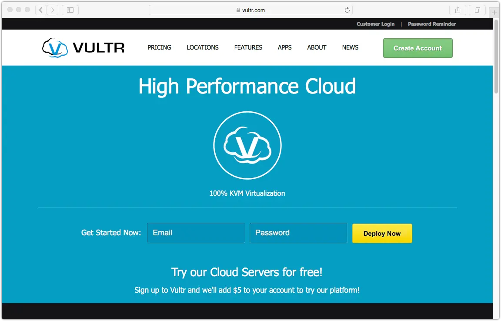
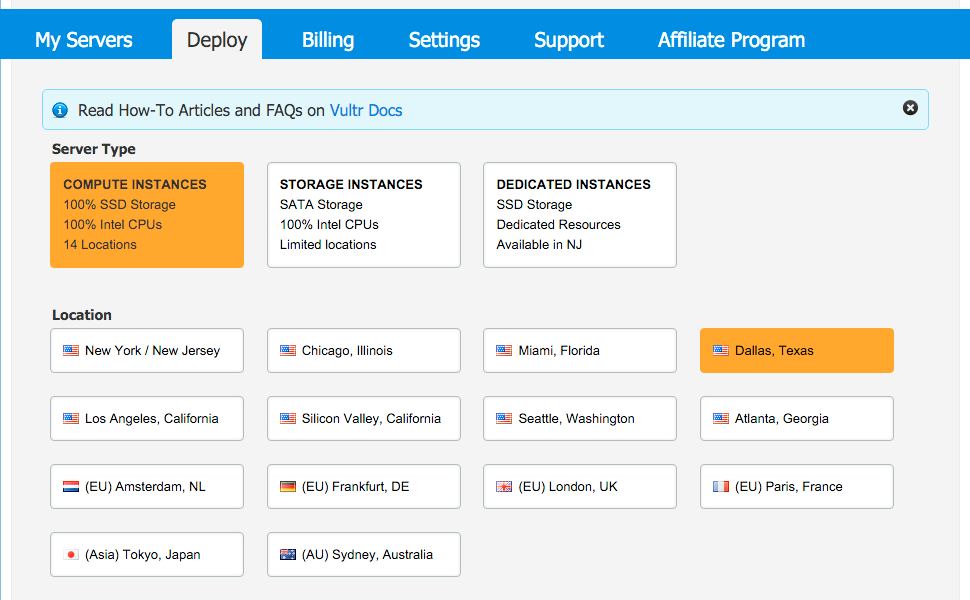
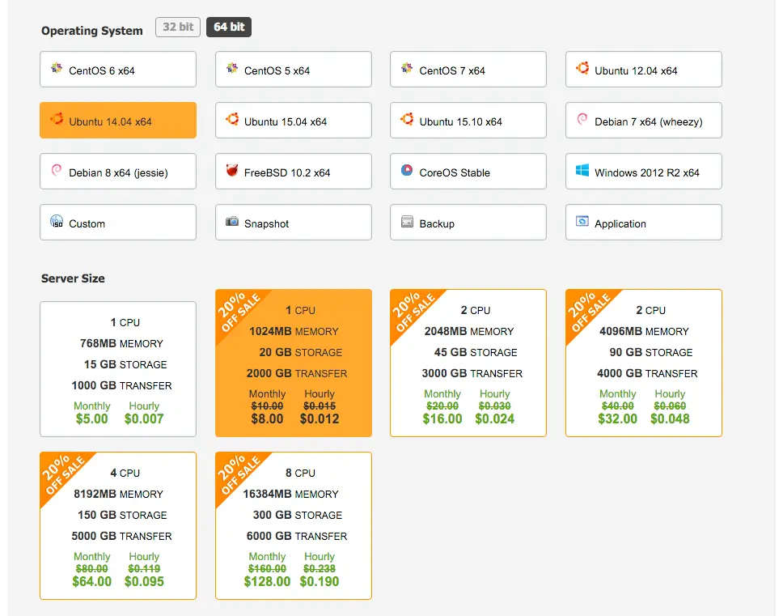
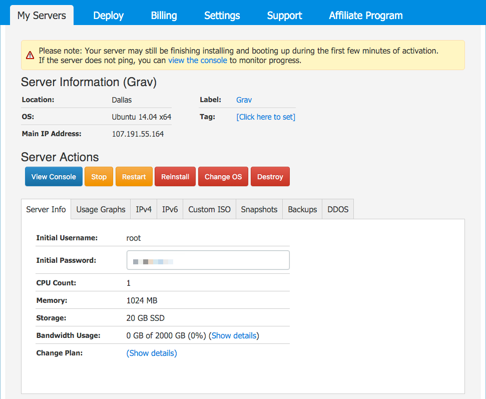

> [!訳注]  
> このページは、内容的に日本のサービスではないので、日本の方で、このページを読む人はほとんどいないと思いますが、以下の内容は Ubuntu バージョンの話などから類推するにかなり古い内容であり、もし読む必要がある場合でも、適宜読み替えながら読んでください。

[Vultr](https://www.vultr.com) は、 **SSD による VPS** 市場に参入し、他の VPS プロバイダと似たような構成と機能を提供しますが、少し安いです。 **100% SSD ストレージ** と、 **ウルトラ速い Intel CPU** そして **14 の低レイテンシロケーション** が得られます。

アカウントを作成し、 **Vultr コントロールマネージャ** に移動したら、 **Deploy** タブをクリックしてください。サーバタイプを **Compute Instances** のままロケーションを選択してください：

次に利用可能なリストから **Operating System** を選択してください。他のガイドとの一貫性から **Ubuntu 18.04 LTS** を選びました。というのも、それは最新で、とても人気で、信頼でき、そしてサポートが手厚いディストリビューションだからです。

**Server Size** で、適切なサイズを選べます。Grav は、どれを選んでもうまく実行できます。このガイドでは、 1 CPU, 1GB メモリオプションを使いましょう。現在、このプランは月額 $8 です。

お好みの追加機能を選ぶこともできます。それから VPS インスタンスを識別するシンプルな **Server Label** を入力してください。ここでは `Grav` とします。 **Place Order** をクリックして、サーバを作成し、インストールします。

1分程度待つと、サーバの準備ができます。サーバ詳細リスト内の、あなたのサーバのとなりに **manage** リンクがあり、それをクリックできるようになります。このページは、初期のルートユーザーとパスワードで、サーバの状態を制御できるコントロールパネルです。ディストリビューションインスタンスを作成したときのパスワードを使って、このタブで提供されるコマンドを経由して SSH 接続できます。公開鍵認証が推奨されます。Vultur では、[SSH 公開鍵認証のドキュメント](https://www.vultr.com/docs/using-your-ssh-key-to-login-to-non-root-users) があるので、必要な手順を踏んでください。

---

[plugin:content-inject](../05.ubuntu-18.04/)

