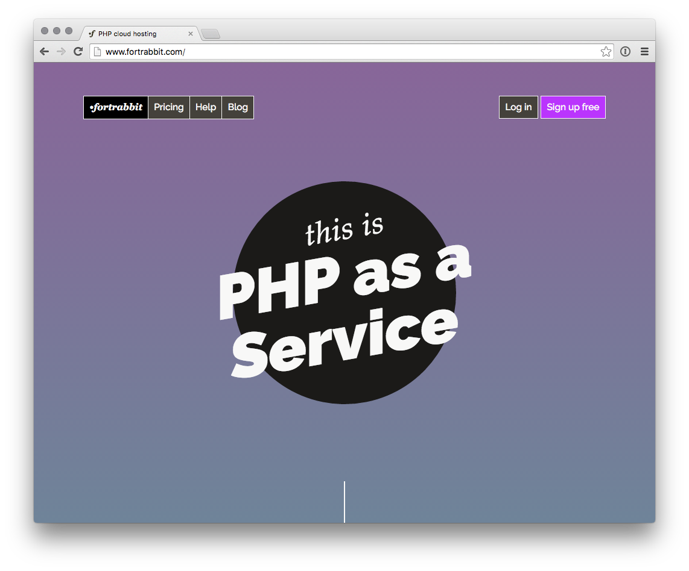

[Fortrabbit](http://www.fortrabbit.com) - fort knox(アメリカ軍基地) のように安全で、うさぎのように速い - は、 PHP 専用のマネージドクラウドホスティングサービスです。ホスティングインフラ指向のマイクロサービスでモダンな PHP 開発をサポートし、 Grav にとってパーフェクトです。Fortrabbit は、 Platform as a Service(PaaS）で、伝統的なホスティングサービスとは少し異なります。



<h2 id="sign-up">登録</h2>

Fortrabbit への登録は、正しく email アドレスを入力し、パスワードを設定するだけです。

<h2 id="spin-up-an-app">アプリの立ち上げ</h2>

プリセットされたものを使うか、コンポーネントを自分でスケーリングさせる設定をするか、選びます。Grav は、（プラグインを使わないなら）大量の RAM は不要です。 Grav は、 MySQL データベースも不要です。選択を解除してください。最小プランで始めて、必要ならスケールアップさせましょう。

**フリートライアル** もあります。これは、機能はすべて使えますが、時間に制限があります。あなたのアプリは、アプリが終了すると同時に破棄されます。それから、また新しく始められます。トライアルを延長することもできます。

<h2 id="install-locally">ローカルにインストール</h2>

まず、最新の Grav をローカルに [ダウンロード](https://getgrav.org/downloads) し、展開してください。サブフォルダの `grav` に展開します。ローカルで Grav サイトを提供するのに、 localhost を設定するかもしれません。

<h2 id="deploy-to-fortrabbit">Fortrabbit にデプロイ</h2>

ここで、プッシュできます。プロジェクトフォルダに移動し、 Fortrabbit に Git remote を設定します：

```bash
$ cd grav
$ git init .
$ git remote add fortrabbit git@deploy.eu2.frbit.com:your-app.git
```

何かをコミットする前に、 `vendor/` フォルダと `cache/` フォルダを除外してください。 `.gitignore` ファイルを作成し、以下を入力してください：

```txt
vendor
cache/*
!cache/.gitkeep
```

あとは、あなたのアプリに何でも add, push してください：

```bash
$ git add -A
$ git commit -m 'Initial'
$ git push -u fortrabbit master
```

完了：最初のデプロイでは、リモート環境での Composer install を伴い、数分かかります。Git の出力ストリームでビルドを見ることができます。これで、サイトがオンラインになりました。各アプリは、ブラウザでアクセス可能な App URL （your-app.frb.io）を持ちます。

2回目以降：テーマやコンテンツをローカルで作成し、 Fortrabbit のマスターブランチにプッシュするだけでデプロイされます。2回目以降のデプロイは数秒です。

<h3 id="further-reading">詳しい読み物</h3>

これは基本的なところだけです。 [Fortrabbit Grav インストール・チューニングガイド](http://help.fortrabbit.com/install-grav) を訪れて、テーマやプラグイン、特色について学んでください。

