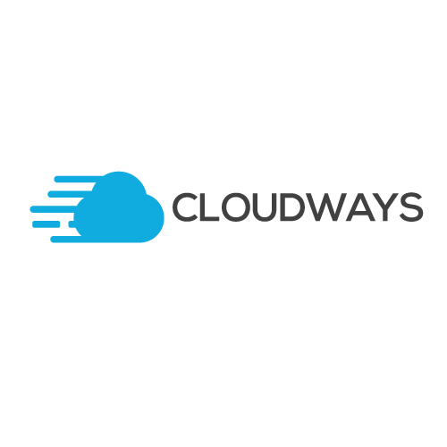

[Cloudways](http://www.cloudways.com) は、 PHP ベースの web アプリ向けのマネージドクラウドプラットフォームです。 Cloudways では、4つのクラウドプロバイダから PHP を実行するサーバを選択できます： DigitalOcean, Vultr, Google Coud Engine (GCE) そして Amazon Web Services (AWS) です。ユーザは、 PHP アプリ開発のためのクラウドサービスを数分でローンチできます。クラウドサーバの管理は、 Cloudways がやってくれます。あなたは、 Grav CMS アプリケーションにのみ責任を持てば良いです。

最近、 Cloudways は [Grav CMS の開発リーダーのひとりである Andy Miller](https://www.cloudways.com/blog/interview-andy-miller/) にインタビューをしました。



<h2 id="signing-up-on-cloudways">Cloudways に登録</h2>

まず GitHub アカウントを使って Cloudway に [アカウントを登録します](https://platform.cloudways.com/signup) 。 Grav CMS クレデンシャルを使いたくない場合は、email アドレスでアカウントを作成できます。 Cloudways に登録し、 PHP スタックのアプリケーションをローンチ後、サーバに Grav CMS をインストールし、実行する以下の手順を進めてください：

<h2 id="installing-and-running-grav-on-cloudways">Cloudways での Grav のインストールと実行</h2>

SSH ターミナルでログインし、アプリケーションの `public_html` フォルダに移動します。

```bash
cd applications/<foldername>/public_html/
```

[Grav CMS ダウンロード](https://getgrav.org/downloads) ページから、ダウンロードリンクをコピーします。ターミナルで、以下のコマンドを使ってダウンロードします

```bash
wget https://github.com/getgrav/grav/releases/download/{{ grav_version }}/grav-admin-v{{ grav_version }}.zip
```

ダウンロード後、 zip ファイルを展開します。

```bash
unzip grav-admin-v{{ grav_version }}.zip
```

以上です！ Grav CMS は Cloudways PHP ホスティングプラットフォーム上で実行できます。アプリケーションのステージング URL で、 URL の最後に、 `/grav-admin` を追加してください。

<h2 id="maintenance-updating-grav-on-cloudways">Cloudways 上の Grav のメンテナンスとアップデート</h2>

ときどき、 Cloudways 上で、その通常のパーミッション構造による Grav の問題に出会うかもしれません。ファイルパーミッションをリセットするために、 Cloudways アカウントにログインし、アプリケーションに移動し、アプリケーション設定で、 [Reset Permission](https://support.cloudways.com/using-the-reset-permissions-button-to-solve-permissions-denied-issues/) をクリックしてください。これによりキャッシュやログイン、アップデートやバックアップに関係するファイルパーミッションのあらゆる問題が解決するかもしれません。

