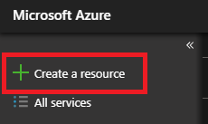
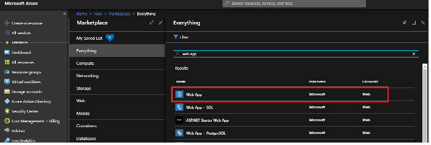
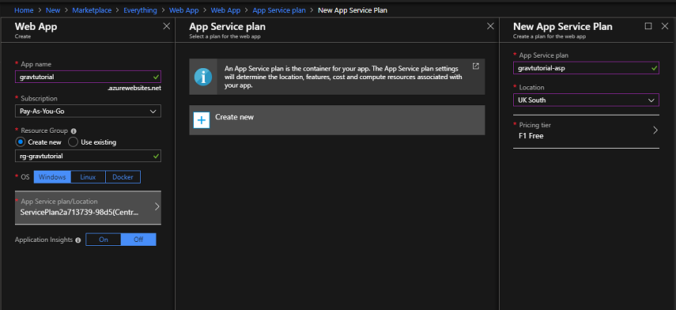
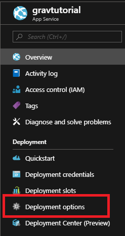

[Microsoft Azure](https://azure.microsoft.com) は、エンタープライズレベルのクラウドコンピューティングプラットフォームで、オープンであり柔軟です。 Azure で Grav をデプロイする方法は複数ありますが、このチュートリアルでは、 Azure の Web App (Paas) を使います。

<h2 id="things-you-ll-need">必要事項</h2>

* Azure のアカウント
* GitHub のアカウント
* Grav のコピー

<h2 id="signing-up-on-azure">Azure に登録</h2>

まず Azure に [アカウントを登録](https://azure.microsoft.com/en-gb/free/) します。最初の 30 日間使える £150 (UK) のクレジットと無料サービスへのアクセス権を得ます。

<h2 id="signing-up-on-github">GitHub に登録</h2>

GitHub アカウントを持っていなければ、 [それにも登録してください](https://github.com/join?source=header-home) 。無料プランで十分です。

<h2 id="clone-grav-source-code">Grav のソースコードを複製</h2>

このチュートリアルを進めるため、 Grav のコピーが必要です。ベースとなる Grav と、管理パネルプラグインファイルのセットをダウンロードし、これらのファイルによる GitHub リポジトリを作っておくことをおすすめします。

これで、 Azure 内で Grav のコピーをデプロイするのに必要なものをすべて手に入れました。

<h2 id="web-config-file">web.config ファイル</h2>

Grav コードに加えて、 web.config ファイルも必要です。web.config ファイルとは、 XML ファイルで、Web アプリのルートフォルダに置かれ、一般的に Web アプリの主要設定や構成を含むファイルのことです。

web.config ファイルの具体例は、 [ここで](https://github.com/getgrav/grav-learn/blob/develop/pages/09.webservers-hosting/03.paas/04.azure/web.config) 手に入ります。この web.config ファイルは、その Web アプリが何をすべきかを網羅し、最新の [Font Awesome パック](https://fontawesome.com) の一部にあるような *.woff* フォーマットや *.woff2* フォーマットのようなファイルフォーマットをしています。

Grav には、そのソースファイルに web.config ファイルの具体例を備えています。 *webserver-configs* フォルダに見つかります。

web.config をセットアップしたら、 Grav の GitHub リポジトリにこれをアップロードします。それはルートディレクトリのレベルである必要があります。

<h2 id="installing-and-running-grav-on-azure">Azure で Grav をインストールし実行</h2>

<h3 id="setting-up-your-web-app">Web アプリをセットアップ</h3>

+ 最初の手順は、 [Azure ポータルにログイン](https://portal.azure.com) し、左側のサイドメニューにある *Create a Resource* をクリックします。

+ *web app* を検索し、サービスを選択します。

+ web アプリサービスの概要を説明する新しいブレードが開きます。ページの下部に *create* ボタンがありますので、これをクリックすると別のブレードが開きます。いくつかの質問が尋ねられます。
    - アプリ名は、あなたのウェブサイトが最初に作成されるときの公開 URL の一部となります
    - サブスクリプションは、web アプリがホスティングされるプランであり、サービスの支払いがここから行われます
    - Azure 内のリソースグループは、サービスを論理的なグループに分ける方法で、グループ名は公開されず、あなただけが見られるものです
    - Azure Web アプリは Windows, Linux もしくは Docker プラットフォームで実行できます。 Grav 向けに Windows を選択します。
    - The App Service Plan/Location determines which data centre your web app will reside in within Azure and the cost of it
    - Application Insights is the service on Azure that can help monitor your web app for issues and understand how your end users are interacting with it.  

My recommendation regarding the App Service Plan would be to select the Dev/Test F1 plan for testing purposes.  The plan has some limitations but it will give you the ability to deploy your first Grav site on Azure without incurring any costs.  In terms of the location I would select one that is close to your location.  Also in this example I would avoid deploying Application Insights as it needs coded in order to integrate with Grav. 

Your Web App should deploy within a few minutes. 

### Install Composer

Composer is a dependency manager for PHP. Composer will manage the dependencies you require on a project by project basis, meaning Composer will pull in all the required libraries, dependencies and for your application.  As Grav is a PHP application we need to ensure the Composer is installed on the Web App for Grav to run properly. 

In order to do this follow these steps:

    - Open up your Web App
    - Click on the Extensions setting
    - Click on Add
    - Select Composer
    - Click OK

Once Composer has installed on your Web App you are now ready to deploy your code. 

### Deploying Your Code

Now that your Web App is up and running and you have the code, it is time to deploy it.  To do that open up the Web App within the Azure Portal. 

+ Navigate to the *Deployment Options* blade 

+ Select GitHub as your source

+ You will be asked for credentials to your GitHub account and then presented with options about which repository and branch to pull from, select the options relevant for you

+ *Azure will now start to pull your code from GitHub, within a few minutes your site should be live*

## Additional Information 

### Custom Domain

If you wish to use your own website URL, please follow the [official documentation](https://docs.microsoft.com/en-gb/azure/app-service/app-service-web-tutorial-custom-domain).

### Always On

By default all Azure Web Apps are unloaded if they are idle for some period of time.  This is to help conserve resources. If you have selected a Basic or Standard plan you can enable the *Always On* mode, which will keep the app loaded all the time.  The Always On setting can be found within the *Application Settings* blade in your Web App. 

### Quotas

If you have selected one of the Free or Shared Web App Plans for your deployment you will be restricted in regards of storage space and compute resources you can use.  To monitor these settings you should monitor the *Quotas* blade. 

