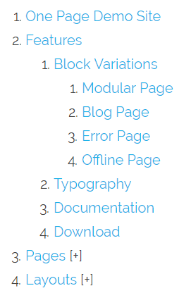

このページでは、一般的な Grav に関するさまざまな問題と、それぞれの解決策を紹介します。

<h2 id="change-the-php-cli-version">PHP CLI のバージョンを変更</h2>

ターミナルで、ときどき、web サーバーの PHP バージョンと異なる PHP が使われていることがあります。

CLI で動いている PHP のバージョンをチェックするには、`php -v` コマンドを実行できます。
Grav のシステム要件は少なくとも PHP 5.5.9 以上であるため、 PHP バージョンが 5.5.9 未満の場合、起動しないでしょう。

> [!訳注]  
> おそらく、上記のバージョンは古い情報で、Grav 1.7 は PHP 7.3.6 以上、Grav 1.8 は、PHP 8.2 以上になると思われます。

どのように直せるでしょう？

ユーザーのホームフォルダにある `.bashrc` や、 `.bash_profile` ファイルに、いくつかの設定を書く必要があります。ユーザーフォルダに、これらのファイルがまだ無い場合は、ファイルを作成してください。これらは隠しファイルなので、表示するためには `ls -al` コマンドをする必要があるかもしれません。一度設定を追記すれば、新しくターミナルのセッションをスタートするだけで、それらの設定が適用されています。

設定例は、以下のとおりです：

```bash
alias php="/usr/local/bin/php53"
export PHP_PATH = /usr/local/bin/php53
```

別の方法では、以下のように追加してください：

```bash
# .bash_profile

# Get the aliases and functions
if [ -f ~/.bashrc ]; then
        . ~/.bashrc
fi

# User specific environment and startup programs

PATH=/usr/local/lib/php-5.5/bin:$PATH:$HOME/bin

export PATH
```

より最近の PHP バージョンのバイナリがある場所の正確な path は、あなたのシステムのセットアップがどのようになっているか次第です。ホスティングのドキュメントに見つかるかもしれませんし、どこにも見つからなければ、ホスティングのセットアップに尋ねることもできます。

または、`/usr/local/bin` フォルダや `/usr/local/lib` フォルダ下の `php-何か` ファイルやフォルダに見つかるかもしれません。`ls -la /usr/local/lib/ |grep -i php` で探せます。

<h2 id="creating-a-simple-gallery">シンプルなギャラリーを作る</h2>

<h5 id="problem">問題：</h5>


よくある web デザインで、ページ内に、いくつかの方法でレンダリングされるギャラリーが欲しいということがあります。新しく家族となったペットの写真や、これまでのデザインワークのポートフォリオ、閲覧者に向けてディスプレイし、販売したい製品のカタログなどです。この例では、下にキャプションの付いたたくさんの写真を表示するしたいだけだと仮定します。もちろん、この例は、他の利用方法にも応用できます。

<h5 id="solution">解決策：</h5>

この課題への最もシンプルな解決策は、 Grav の [メディア機能](../../02.content/07.media/) を使うことです。この機能により、ページから、そのフォルダ内の画像が利用可能となります。

`gallery.md` というページがあったとしましょう。そして、同じディレクトリにたくさんの画像があるものとします。それぞれのファイル名自体は、重要ではなく、画像は繰り返し表示できれば良いものとします。それぞれの画像に関係する追加データが欲しいので、 `meta.yaml` ファイルをそれぞれの画像につき追加します。たとえば、いくつかの画像について、次のようになります：

```yaml
- fido-playing.jpg
- fido-playing.jpg.meta.yaml
- fido-sleeping.jpg
- fido-sleeping.jpg.meta.yaml
- fido-eating.jpg
- fido-eating.jpg.meta.yaml
- fido-growling.jpg
- fido-growling.jpg.meta.yaml
```

それぞれの `.jpg` ファイルは、フルサイズのバージョンに適した比較的良いサイズで、 1280px x 720px あります。 `meta.yaml` ファイルには、それぞれいくつかの重要な項目が含まれています。 `fido-playing.jpg.meta.yaml` を見てみましょう：

```yaml
title: Fido Playing with his Bone
description: The other day, Fido got a new bone, and he became really captivated by it.
```

これらのメタファイルに何を書くかは、 **完全にコントロールできます** 。必要なものは何でも書けます。

次に、これらの画像を表示していきます。時間降順で、つまり新しい画像から先に表示していきます。ページは、 `gallery.md` というファイル名なので、適切な `templates/gallery.html.twig` ファイルを作成し、必要なレンダリングロジックを書いていきます：

```twig



    {{ page.content|raw }}

    <ul>
    
    <li>
        <div class="image-surround">
            {{ image.cropResize(300,200).html|raw }}
        </div>
        <div class="image-info">
            <h2>{{ image.meta.title }}</h2>
            <p>{{ image.meta.description }}</p>
        </div>
    </li>
    
    </ul>


```

別のページ内に表示するモジュラーギャラリーにするには、機能させるために、以下のコードを Twig ファイルから削除してください：

```twig



    {{ page.content|raw }}
```

及び、

```twig

```

基本的に、これは標準的な `partials/base.html.twig` を拡張するものです（あなたのお使いのテーマに、このファイルがある前提での話です）。その次の行で、 `content` ブロックを定義し、そこにコンテンツを提供します。最初にやるべきは、なにか `page.content` を出力することです。これは、 `gallery.md` ファイルのコンテンツなので、このページのタイトルと説明を含んでいます。

> [!訳注]  
> モジュールにしたときに、 page.content が不要になるのは、別モジュールで説明やコンテンツに相当するものを書くだろうという想定なのだろうと思います。

次のセクションでは、ページのすべての画像メディアを、シンプルにループで繰り返しています。これらの出力は、順番無しリスト（ `<ul>` ）としています。出力をセマンティック（意味論的）にするためと、 CSS でスタイルを当てやすくするためです。各画像に、 `image` という twig 変数を割り当て、シンプルに `cropResize()` メソッドを実行し、画像の良い感じにリサイズしています。それから、その下の行で、情報セクションを提供しています。画像のメタデータの `title` と、 `description` です。

[EXIF](../../03.themes/04.twig-tags-filters-functions/03.functions/#exif) 機能を使って、カメラのデータをフィルタリングすることで、もっと高度なギャラリーを実装することもできます。

<h2 id="render-content-in-columns">カラムに分けてコンテンツをレンダリングする</h2>

<h5 id="problem-1">問題：</h5>

ときどき来る質問ですが、ひとつのページを、複数のカラムで縦に分割してすばやくレンダリングする方法についてです。

<h5 id="solution-1">解決策：</h5>

ありうる解決策はたくさんありますが、シンプルなものとして、コンテンツを意味のあるセクションごとに、区切り（ HTML の `<hr />` や、 *themantic break* タグ）で分割するという方法があります。マークダウンでは、区切りは 3つ以上のダッシュもしくは `---` で表現されます。コンテンツをシンプルに作り、これらのダッシュマークでコンテンツをセクションごとに分割します。

**columns.md**

```md
---
title: 'Columns Page Test'
---

Lorem ipsum dolor sit amet, consectetur adipiscing elit. Maecenas arcu leo, hendrerit ut rhoncus eu, dictum vitae ligula. Suspendisse interdum at purus eget congue. Aliquam erat volutpat. Proin ultrices ligula vitae nisi congue sagittis. Nulla mollis, libero id maximus elementum, ante dolor auctor sem, sed volutpat mauris nisl non quam.

---
Phasellus id eleifend risus. In dui tellus, dignissim id viverra non, convallis sed ante. Suspendisse dignissim, felis vitae faucibus dictum, dui mi tempor lectus, non porta elit libero quis orci. Morbi porta neque quis magna imperdiet hendrerit.

---
Praesent eleifend commodo purus, sit amet viverra nunc dictum nec. Mauris vehicula, purus sed convallis blandit, massa sem egestas ex, a congue odio lacus non quam. Donec vitae metus vitae enim imperdiet tempus vitae sit amet quam. Nam sed aliquam justo, in semper eros. Suspendisse magna turpis, mollis quis dictum sit amet, luctus id tellus. Vestibulum ante ipsum primis in faucibus orci luctus et ultrices posuere cubilia Curae; Aenean eu rutrum mi.
```

> [!Note]  
> カラムが終わった後と、 `---` の前には、空行が必要です。なぜなら、テキストのすぐ下に3つのダッシュマークを置くと、マークダウンの見出しとして解釈されてしまうからです。

それから、このコンテンツを `columns.html.twig` テンプレート（ページファイル名が `columns.md` だったとします）により、レンダリングする必要があります：

```twig



    <table>
        <tr>
            
            <td>{{ column|raw }}</td>
            
        </tr>
    </table>

```

見てのとおり、コンテンツが `<hr />`タグによって **split** （分割）されており、3つのカラムの配列に変換され、それをループで繰り返し、レンダリングしています。この例では、シンプルな HTML の table タグを使っていますが、お好みのものをお使いください。

> [!Note]  
> page-toc プラグインを使う場合は、このプラグインは HTML コードをきれいにするため、 `|split('<hr>')` を使う必要があります。


<h2 id="really-simple-css-image-slider">本当にシンプルな CSS 画像スライダー</h2>

<h5 id="problem-2">問題：</h5>

余計な読み込み無しの画像スライダーが欲しい場合です。

<h5 id="solution-2">解決策：</h5>

このレシピでは、4つの画像を使い、 `slider.md` というページを作ります！ シンプルに画像を `.md` ファイルのあるフォルダに置きます。次に、新しく Twig テンプレートを作成し、 `base.html.twig` を拡張します。


```twig




    <div id="slider">
        <figure>
        
            {{ image.html|raw }}
        
        </figure>
    </div>

    {{ page.content|raw }}

```

モジュラーページで使うスライダーなら、以下の部分を上記の Twig ファイルから削除してください。

```twig



```

及び、

```twig

```

CSS の編集をします。以下の内容を、` _custom.scss` ファイルに追記してください。

```scss
@keyframes slidy {
    0% { left: 0%; }
    20% { left: 0%; }
    25% { left: -100%; }
    45% { left: -100%; }
    50% { left: -200%; }
    70% { left: -200%; }
    75% { left: -300%; }
    95% { left: -300%; }
    100% { left: -400%; }
}
body { margin: 0; }
div#slider {
    overflow: hidden;
    margin-top: -3rem;
    max-height: 30rem;
}
div#slider figure img { width: 20%; float: left; }
div#slider figure {
    position: relative;
    width: 500%;
    margin: 0;
    left: 0;
    animation: 30s slidy infinite;
}
```

以上です。

<h2 id="wrapping-markdown-into-html">マークダウンを HTML に入れる</h2>

ページによっては、新しく Twig テンプレートを作ることなく、マークダウンコンテンツの一部を、カスタムの HTML コードに入れて使いたいことがあります。

これを解決するため、以下のようなステップを踏みます：

config ファイルの `user/config/system.yaml` で、markdown extra オプションを有効化してください：

```yaml
pages:
  markdown:
    extra: true
```

マークダウンを囲みたいタグに、 `markdown="1"` というパラメータを追加して、マークダウンコンテンツの処理を実行してください：

```md
<div class="myWrapper" markdown="1">
# my markdown content

this content is wrapped into a div with class "myWrapper"
</div>
```

以上です。

<h2 id="add-a-recent-post-widget-to-your-sidebar">サイドバーに最近の投稿ウィジェットを追加する</h2>

<h5 id="problem-3">問題：</h5>

サイドバーに、最近の投稿を表示するウィジェットを作りたいです。

<h5 id="solution-3">解決策：</h5>

部分的なテンプレートを `partials/base.html.twig` で拡張させるのは、常に可能です（このページの他の解決策の例を見てみてください）。しかし、ここでは完全なテンプレートを作っていきます。最終的な Twig テンプレートは、以下のようになります：

```twig
<div class="sidebar-content recent-posts">
    <h3>Recent Posts</h3>
    
        
        <div class="recent-post">
            
                <div class="recent-post-image">{{ bannerimage.cropZoom(60,60).quality(60) }}</div>
            
                <div class="recent-post-image"></div>
            
            <div class="recent-post-text">
                <h4><a href="{{p.url}}">{{ p.title }}</a></h4>
                <p>{{ p.date|date("M j, Y")}}</p>
            </div>
        </div>
    
</div>
```

このコードでやっていることは、 `/blog` ページのすべての子ページ（ブログ投稿）を、日付降順でソートします。それから、最初の5つのブログ投稿を、 Twig フィルターの `slice` を使って切り出します（ところで、 `slice(n,m)` は、`n` 個目から `m-1` 個目を取り出します）。
この例では、バナー画像を持つブログ投稿のバナー画像には、 `banner.jpg` という名前が付いているという前提です。この画像に、 `bannerimage` という twig 変数を設定します。もし `bannerimage` が存在すれば、 `60px x 60px` の正方形に小さくされ、投稿タイトルと日付の左側に表示されます。存在しなければ、かわりに web サイトのロゴが `60px x 60px` にリサイズされ、タイトルと日付の左に表示されます。

このウィジェットの CSS は、以下のようになります：

```css
.sidebar-content .recent-post {
    margin-bottom: 25px;
    padding-bottom: 25px;
    border-bottom: 1px solid #F0F0F0;
    float: left;
    clear: both;
    width: 100%;
}

.sidebar-content [class~='recent-post']:last-of-type {
    border-bottom: none;
}

.sidebar-content .recent-post .recent-post-image,
.sidebar-content .recent-post .recent-post-text {
    float: left;
}

.sidebar-content .recent-post .recent-post-image {
    margin-right: 10px;
}

.sidebar-content .recent-post .recent-post-text h4 {
    font-family: serif;
    margin-bottom: 10px;
}

.sidebar-content .recent-post .recent-post-text h4 a {
    color: #193441;
}

.sidebar-content .recent-post .recent-post-text p {
    font-family: Arial, sans-serif;
    font-size: 1.5rem;
    color: #737373;
    margin: 0;
}
```

投稿アイテムどうしの余白や、font-family, font-size, font-weight などは、お好みに合わせて調節してください。

<h2 id="create-a-private-area">プライベートエリアを作る</h2>

Grav なら、 web サイトにプライベートエリアを作るのも簡単です。
すべて Login プラグインのおかげです。

<h2 id="require-users-to-login-prior-to-access-a-part-of-the-site">サイトの一部にアクセスするためにユーザーにログインを要求する</h2>

もしまだなら、 Login プラグインを管理パネルか、 GPM コマンドラインを使ってインストールしてください。

次に、管理パネルでページを開きます。 expert モードに変え、フロントマターのセクションに、次を追加します。

```yaml
access:
    site.login: true
```

ページにアクセスしたユーザーは、ページのコンテンツを見たいならログインする必要があります。

注意点として、デフォルトではサブページにパーミッションは拡張されません。拡張するには、 Login プラグインから設定で、 "Use parent access rules" を有効化します。

このオプションにより、アクセスレベルを気にすることなく、プライベートエリアを拡張できます。アクセス制限のあるページの下に、すべてを置くだけです。

<h2 id="require-special-permissions-to-view-one-or-more-pages">ページの閲覧に特別なパーミッションを要求する</h2>

上記の処理と似た方法で、ページに好きなパーミッションを割り当てられます。独自のパーミッション名を設定することも可能です。

具体例：

```yaml
access:
    site.onlybob: true
```

次に、 `site.onlybob` パーミッションを Bob に追加します。 `user/accounts` フォルダの `bob.yaml` ユーザーファイルでできます：

```yaml
access:
    site.onlybob: true
```

<h2 id="use-group-based-permissions">グループ単位のパーミッションを使う</h2>

また、ユーザーをグループに分け、パーミッションを個々のユーザーではなく、グループに割り当てることもできます。ユーザーは、グループのパーミッションを継承します。

たとえば、以下の内容で、 `user/config/groups.yaml` ファイルを追加してください：

```yaml
registered:
  readableName: 'Registered Users'
  description: 'The group of registered users'
  access:
    site:
      login: true
premium:
  readableName: 'Premium Members'
  description: 'The group of premium members'
  access:
    site:
      login: true
      paid: true
```

次に、`user/accouns` フォルダ以下の yaml ユーザーファイルに、

```yaml
groups:
      - premium
```

上記の内容を追加することで、ユーザーを割り当ててください。

これで、 `premium` グループに属しているユーザーは、 `site.paid` パーミッションのあるページにアクセスできるようになりました。

<h2 id="add-javascript-to-the-footer">フッターにJavaScript を追加する</h2>

多くのケースで、 "いくつかの" JavaScript を、コンテンツがレンダリングされたあとに読み込むために、ページのヘッダーではなく、フッターに追加したいことがあるでしょう。

これを実行する良い例として、 Antimatter テーマをチェックしましょう。

Antimatter の `templates/partials/base.html.twig` では、 js のために `{{ assets.js('bottom') }}`を呼び出して、 bottom ブロックを定義しています。

```twig

    {{ assets.js('bottom') }}

```

このブロックに、アセットを追加できます。たとえば、 Twig では、以下を呼び出します。

```twig

```

もしくは、 PHP では、以下を呼び出します。

```php
$this->grav['assets']->addJs($this->grav['base_url'] . '/user/plugins/yourplugin/js/somefile.js', ['group' => 'bottom']);
```

<h2 id="override-the-default-logs-folder-location">デフォルトのログフォルダの場所を上書きする</h2>

Grav がログを出力する場所は、デフォルトではシンプルに `logs/` と呼ばれています。残念ながら、（レンタルサーバーの設定や別システムによって） `logs/` フォルダがすでに使われていたり、立ち入り禁止になっていたりする場合があります。Grav の柔軟なシステムによって、これらのフォルダの場所をカスタマイズできます。

まず、新しいフォルダを作成する必要があります。この例では、 `grav-logs/` という新しいフォルダを Grav をインストールしたルートフォルダの中に作成しました。それから、新しく `setup.php` というファイルをルートレベルに作り、以下のコードを貼り付けます：

```php
<?php
use Grav\Common\Utils;


return [
    'streams' => [
        'schemes' => [
            'log' => [
               'type' => 'ReadOnlyStream',
               'prefixes' => [
                   '' => ["grav-logs"],
               ]
            ]
        ]
    ]
];
```

これは、基本的に `system/src/Grav/Common/Config/Setup.php` で定義されている `log` ストリームを、デフォルトの `logs/` フォルダではなく `grav-logs/` フォルダに上書きしています。

<h2 id="split-vertical-menu-system">メニューシステムを縦に分ける</h2>

縦に分けられた、折りたたみ式の、階層性のあるページメニューを作るには、 Twig のループと、少しの CSS と、少しの JavaScript が必要です。 Antimatter テーマを使った、最終的な結果は、以下のような見た目になります：



Twig から始めていきましょう：

```twig
<ol class="tree">
    
        
            <li class="item">
            <a href="{{ page.url }}">{{ page.title }}</a>
        
            <li class="parent">
            <a href="javascript:void(0);">{{ page.title }}</a>
            <ol>
                
                    
                        <li class="item">
                        <a href="{{ child.url }}">{{ child.title }}</a>
                    
                        <li class="parent">
                        <a href="javascript:void(0);">{{ child.title }}</a>
                        <ol>
                            
                                <li><a href="{{ subchild.url }}">{{ subchild.title }}</a></li>
                            
                        </ol>
                    
                    </li>
                
            </ol>
        
        </li>
    
</ol>
```

ここでは、 Grav 内のすべての公開ページを繰り返して、順番付きリストを作成しています。深さで3つのレベルに分け、それぞれのレベルの構造を作成しています。全体の構造を包んでいるリストは、 *tree* という class を持ち、それぞれのリストアイテムは、子要素があれば *parent* という class を持ち、子要素が無ければ *item* という class を持ちます。

parent 要素をクリックすると、リストが開きます。通常の item のリンクは、ページそのものに飛びます。 Grav が公開ページにアクセスできるなら、このコードは、 Grav テーマ内のほぼすべての Twig テンプレートに追加できます。

少しスタイルをあてるため、 CSS を追加します：

```css
<style>
ol.tree li {
    position: relative;
}
ol.tree li ol {
    display: none;
}
ol.tree li.open > ol {
    display: block;
}
ol.tree li.parent:after {
    content: '[+]';
}
ol.tree li.parent.open:after {
    content: '';
}
</style>
```

これは一般的に、 Twig 構造の前に置かれるか、理想的には、テーマの [アセット管理](../../03.themes/07.asset-manager/) へ流し込むべきです。効果としては、各 parent アイテムの後に **[+]** を追加し、開くことを示し、開くと消えます。

最後に、 *open* class を [トグルするハンドル](https://stackoverflow.com/a/36297446/603387) のため、少しの JavaScript を追加しましょう：

```js
<script type="text/javascript">
var tree = document.querySelectorAll('ol.tree a:not(:last-child)');
for(var i = 0; i < tree.length; i++){
    tree[i].addEventListener('click', function(e) {
        var parent = e.target.parentElement;
        var classList = parent.classList;
        if(classList.contains("open")) {
            classList.remove('open');
            var opensubs = parent.querySelectorAll(':scope .open');
            for(var i = 0; i < opensubs.length; i++){
                opensubs[i].classList.remove('open');
            }
        } else {
            classList.add('open');
        }
    });
}
</script>
```

このコードは、常に Twig 構造の **後に** 置かなければいけません。こちらも、理想的には [アセット管理](../../03.themes/07.asset-manager/) を使ってください。

<h2 id="dynamically-style-one-or-more-pages">1つ以上のページで動的にスタイルをあてる</h2>

テーマの Twig ファイルをカスタマイズすることで、ページのフロントマターで変数として渡された CSS class を（テンプレートファイルの適用とは独立して）適用し、 Grav サイトのそれぞれ異なるページや投稿に、動的にスタイルをあてることができます。

2つの方法により、このスタイル設定ができます：

1. Antimatter テーマを使っている場合、そのページのためにカスタム CSS class を設定するための既存の `body_classes` というヘッダープロパティを使えます。
2. Antimatter をベースにしていないテーマを使っている場合（もしくは Antimatter のような `body_classes` を実装していない場合）、テーマの Twig ファイルをカスタマイズして、ページのヘッダープロパティで変数として渡された CSS class を適用できます。

たとえば、テーマの `base.html.twig` ファイルや、 `page.html.twig` ファイルのような特定のテンプレートで、ページコンテンツの表示に使われる class を追加できます。このように：

```html
<div class="{{ page.header.body_classes }}">
...
</div>
```

そして、ユニークなスタイルをあてたいそれぞれのページに、次のようなヘッダープロパティを追加します（CSS class として `featurepost` が定義されているという前提です）：

```yaml
body_classes: featurepost
```

> [!Note]  
> このようにして、 Antimatter テーマはページに特有の class を適用しています。これは参考にして欲しい標準的な良い方法です。

<h2 id="migrate-an-html-theme-to-grav">HTML テーマを Grav に移植する</h2>

HTML テーマを Grav へ移植するのは、よくある作業です。ここではハンズオン形式で、この目標を達成するためのプロセスをひとつずつ紹介します。

おそらくあなたは、テーマをダウンロードしたことがあり、そしてそれは、いくつかの HTML ファイルで構成されているでしょう。シンプルに、 Grav がホームページを読み込むようにするところから始めましょう。コンテンツはカスタマイズせず、ただ Grav 構造の中で HTML テーマを複製するだけです。

まず、空のテーマを作るために、 [Grav Devtools プラグインを使います](../../03.themes/02.theme-tutorial/) 。そして、 Grav のシステム設定で、それを使えるように設定します。

テーマの templates フォルダに、 Twig ファイルの `templates/home.html.twig` を作ります。これは、ホームページ専用のテンプレートになります。通常、ホームページ（トップのページ）は、サイトで唯一無二のページなので、おそらく専用の Twig ファイルを用意するでしょう。

テンプレートのホームページから、 `home.html.twig` ファイルへ、 HTML のコードを `<html>` から `</html>` までコピーしてください。

次に、すべての HTML テーマアセット（画像、 CSS 、JS ）をテーマフォルダに移してください。既存のテーマフォルダの構造をキープしても良いですし、変更してもかまいません。

`pages/01.home/home.md` という空のファイルを作成してください。この時点で、 `yoursite.com/home` にはコンテンツが表示されますが、おそらく `/img/*` や `/css/*` などの link タグでハードコーディングされているので、 CSS や、 JS や、画像は読み込まれないでしょう。

<h4 id="adding-the-correct-asset-links">アセットリンクを正しく追加する</h4>

Grav では、ホームへのルーティングを指しており、 Grav のルートフォルダで、 `/user/themes/mytheme/img` ではなく、 `/img` を指しているため、 link は壊れます。テーマに関係するアセットは、 theme フォルダ内に置くのがベストなので、 Grav を正しい場所へ指し示すようにしなければいけません。

テンプレートページ内でアセットを検索し、画像の参照先を `img/*.*` から `` へ変更します。

スタイルシートは、もう少し考えるところがあります。利便性から有効化したいアセットパイプラインがあるためです。よって、 `<head>` タグ内のスタイルシートブロックにそれらを移動させます。

具体例：

```twig

    

{{ assets.css()|raw }}
```

同じことを、 JavaScript ファイルにも適用します。フッターで読み込まれる JS も追加で必要です。

具体例：

```twig

    
    

{{ assets.js()|raw }}
```

この変更は、これでブラウザに反映されます。もしなっていなければ、ページキャッシュと twig キャッシュを Grav のシステム設定で無効にしてください。

これは始まりに過ぎません。もっと多くのページを追加する必要があるかもしれませんし、ページの内容を表現するより良い方法を考える必要があるかもしれません。そのためには、ページのフロントマターを使ったり、典型的な構成要素（ホームページで言えば、推薦文や、レビュー、プロダクトの機能紹介など）を処理するカスタマイズされた Twig を使うことを考える必要があるかもしれません。

<h4 id="adding-another-page">他のページも追加する</h4>

他のページを追加する場合も、やり方は同じです。たとえば、次に blog ページを追加したいとしましょう。
先ほどやったことの繰り返しで、 `templates/blog.html.twig` ファイルを追加し、 HTML ソースを貼り付け、そして `pages/02.blog/blog.md` ページを作成します。

次に、ページ内の画像リンクはまだ、 Grav のアセット構文に移行する（もしくは path を変更する）必要がありますが、 CSS と JS アセットについては、上記と同じことを繰り返したくありません。サイト全体で再利用されるべきです。

<h4 id="shared-elements">要素の共有</h4>

ページの共通パーツ（ヘッダーやフッター）を分け、それら共通部分を `templates/partials/base.html.twig` ファイルに移動させます。

それぞれのページテンプレートは、これにより、 `partials/base.html.twig` を拡張する必要があります (https://github.com/getgrav/grav-theme-antimatter/blob/develop/templates/default.html.twig#L1) 。それから、個々のコンテンツを追加するだけです。

<h2 id="add-an-asset-to-a-specific-page">特定のページにだけアセットを追加する</h2>

<h4 id="problem-4">問題：</h4>

テーマの特定のテンプレートに、アセットを追加する必要があります。

<h4 id="solution-4">解決策：</h4>

多くの場合、アセットファイルは、以下のようにしてベーステンプレートの twig ブロックに追加されているでしょう。

```twig

    

{{ assets.js()|raw }}
```

アセットを追加するために、テンプレートのこのブロックを拡張しなければいけません。そのために、 `{{ parent() }}` を呼び出す必要があります。これにより、すでにベーステンプレートで追加しているアセットを取得できます。
"ポートフォリオのギャラリー" ページに、 "gallery.js" ファイルを追加したいとしましょう。
テンプレートを編集して、 `{{ parent() }}` とともにアセットを追加してください。

```twig

  
  {{ parent() }}

```

<h2 id="reuse-page-or-modular-content-on-another-page">ページやモジュラーコンテンツを他のページで再利用する</h2>

<h4 id="problem-5">問題：</h4>

多くのページやモジュラーがすでにあり、同じコンテンツブロックを1つ以上のページでシェアしたいです。同じテキストコンテンツを複数ファイル作り、それぞれをメンテナンスするようなことはやりたくないです。

<h4 id="solution-5">解決策：</h4>

以下は、プラグインや管理パネルを使わずにできる、とてもシンプルでストレートな方法です。

**注意：** より高度な場面に対しては、この機能にぴったりな [Grav Page Inject プラグイン](https://github.com/getgrav/grav-plugin-page-inject) もあります。

まず、コンテンツのプレースホルダとしての役割を持つ、新しいテンプレートファイルを作ります。 - どんな名前でも良いですが、ここでは `modular_reuse` としましょう。そして、今回の例では、それをテーマの `templates/modular` フォルダに置きます。ただし、テンプレートフォルダ内のどこに置いてもかまいません。


`modular_reuse.html.twig` のコンテンツは、たった1行です：

```twig
{{ page.content|raw }}
```

次に、新しいモジュラーページを、管理パネルで作ります。この新しい `modular_reuse` テンプレートを使うコンテンツが表示されるべき場所に作ってください。新しいページ名は、表示されることは無いため、好きに付けてかまいません。 - オリジナルのページタイトルが出力されます。

ページのコンテンツは、たった1行です：

ページ：

```twig

```

モジュラー：

```twig

```

`include` の後に書いてあることは、先ほどのステップ1で保存したテンプレートの場所で、おそらくページならば `templates` フォルダとなり、モジュラーなら `templates/modular` フォルダーとなるはずです。

page.find の後には、再利用したいオリジナルコンテンツへの実際のリンクが来ます。モジュラーコンテンツは `_` で始まりますが、ページはそうではありません。正しいリンク先を探す最も簡単な方法は、管理パネルでページを開いてみて、 url の `admin` というワードの後をコピーすることです。

最終的なページは、次のようになります：

```twig
---
title: 'Modular Reuse Example'
---


```

これで、 "amazing offers" が複数の場所で表示されるようになり、しかし更新は1箇所で済みます。

<h2 id="make-a-custom-anti-spam-field-for-your-contact-for">問い合わせフォームにカスタムのアンチ・スパムフィールドを作る</h2>

<h4 id="problem-6">問題：</h4>

honeypot フィールドのようなスパム対策の標準的な方法は、特定のスパムボットに通過されてしまう。

<h4 id="solution-6">解決策：</h4>

問い合わせフォームに入力するとき、ボットがフィールドを入力するべきかどうかを判断しづらくします。簡単に言うと、ユーザーが間違えるはずのない、しかしボットにはその意味を理解するのが難しい問題を訊ねます。マークダウンファイルに、 [フォームデータ](../../06.forms/02.forms/03.example-form/) とともに、以下のフィールドを追加します：

```yaml
    - name: personality
      type: radio
      label: "五 掛ける 八 は？"
      options:
        alaska: 32
        oklahoma: 40
        california: 48
      validate:
        required: true
        pattern: "^oklahoma$"
        message: Not quite, try that math again.
```

この問題は、シンプルなものでありつつ、しかし簡単な誤答が複数あるものが良いです。
重要なのは、答えの順番です。正しい答えは、最初の選択肢であってはいけません；真ん中のどこかが良いです。答え（label）の前の値をランダムにすることは重要です。関係する値と答えのデータベースは、答えるときに役に立ちません。

ボットは、ずっと賢くなってきていますが、最初の試行に失敗すると、同じ質問に何度か答えるのを見送る傾向があります。
また、最も賢いボットでさえ、既知の辞書データをもとに答えを出します。
単純な問題 "五 掛ける 八 は？" を尋ねて、3つの選択肢 "32", "40", "48" を与えます。
正しい答えは明らかに "40" ですが、ボットの数学スキルをチェックするのではなく、3つの数字に  "alaska", "oklahoma", and "california" という値を割り当てています。
なぜなら、ボットは、数字のラベルではなく、地名の値を見るからです。答えは問題に全く関連がありません。
"mississippi" という値に "Pineapple" という答えを追加し、それに対してバリデーションをして、ユーザーに答えを選んでもらうことさえできます。
ポイントは、データのランダム化を個人的に作ることです。

<h2 id="display-different-robots-txt-contents-for-differen">異なる環境で異なる robots.txt コンテンツを表示する</h2>

<h4 id="problem-7">問題：</h4>

あなたは、開発用サイトとして `dev.yourdomain.com` というサブドメインをセットアップしました。そのサイトは、 `yourdomain.com` への変更を公開する前に機能するかどうか確認するためのサイトで、検索エンジンなどのクローリングでインデックスされたくありません。本番サイトは、検索結果に表示されたままでいて欲しいです。

<h4 id="solution-7">解決策：</h4>

開発サイトは、プライベート状態にして、パスワード保護されるべきですが、ときには、シンプルに検索エンジンにインデックスを禁止し、サイトをクローリングさせないだけで十分であるし、より現実的な場面はあります。
幸運なことに、 Grav では html フォーマットと同じように txt フォーマットでページを制御できるため、 [環境設定](../../08.advanced/04.environment-config/) と twig テンプレートを使ってこの問題を解決することができます。

まず、 `site.yaml` 設定ファイルを作りましょう。 `dev.yourdomain.com` テンプレートファイルに、開発環境であることを伝えます。

`/user/[dev.yourdomain.com]/config/site.yaml`:

```yaml
environment: dev
```

それから、 `robots.txt.twig` ページテンプレートを作成します。これは、 Grav が開発サイトを運用中かどうかをチェックし、それ次第で異なるコンテンツを表示するものです。

`/user/themes/[yourtheme]/templates/robots.txt.twig`:

```twig


{{ rule }}



{{ page.content|raw }}


```

最後に、 `/robots.txt` にルーティングするページを作ります。
デフォルトの `robots.txt` のルールは、ページコンテンツに、代替の開発環境バージョンのルールは、ページフロントマターに書きます。ページコンテンツを html ではなく、そのままレンダリングするため、マークダウンによるレンダリングを無効にします。

`/user/pages/robots/robots.md`:

```md
---
routes:
  default: /robots.txt
process:
  markdown: false

dev:
  - 'User-agent: *'
  - 'Disallow: /'
---

User-agent: *
Disallow: /backup/
Disallow: /bin/
Disallow: /cache/
Disallow: /grav/
Disallow: /logs/
Disallow: /system/
Disallow: /vendor/
Disallow: /user/
Allow: /user/pages/
Allow: /user/themes/
Allow: /user/images/
Allow: /user/plugins/*.css$
Allow: /user/plugins/*.js$
```

これで、あなたのサイトのルートディレクトリに、動的なコンテンツを表示する `robots.txt` ファイルが設置されました。またこれは、管理パネルプラグインで編集可能です。

注意： 本番サイトでは、 `Disallow: /` を表示しないようにしてください。検索エンジンの表示を完全に消し去ってしまいます。

