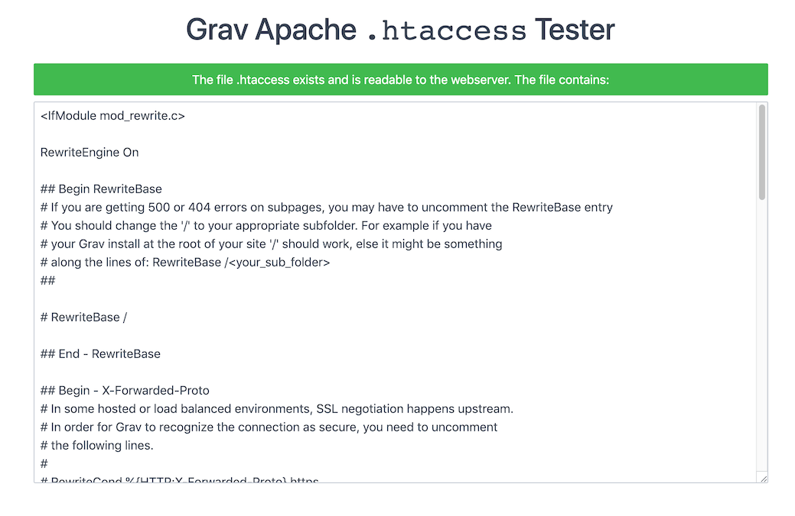

**Not Found** エラー（ページが見つかりませんというエラー）には、いくつかの理由があり、それぞれ、異なる原因によるものです。


> [!Info]  
> 以下の具体例は、Apache webサーバーのものです。最も一般的に使われているサーバーソフトウェアです。

> [!訳注]  
> 「具体例は Apache サーバーのものです」と言った直後に、なぜいきなり IIS サーバーの話が始まるのか、謎です。

### IIS use of .htaccess file

Web Platform Installer を使って IIS サーバーに URL Rewrite を追加したあと、IIS サーバーを再起動します。IIS の管理インターフェースから URL Rewrite をダブルクリックし、Inbound Rules の下にある Import Rules をクリックし、Rules to Import の下にある Configuration ファイルを閲覧し、ルートにある .htaccess ファイルを選択し、それから Import をクリックします。IIS サーバーを再起動します。これで、Grav にアクセスできます。

### Missing .htaccess File

最初にチェックしてほしいのは、 Grav をインストールしたルートフォルダに、 `.htaccess` ファイルがっ提供されているかどうかです。 .htaccess ファイルは **隠し** ファイルであるため、エクスプローラーや windows のファインダーからは、普通は見えません。 Grav を展開し、ファイルを **選択** し、それから　**移動** もしくは **コピー** した場合、このとても重要なファイルが、前のフォルダに置き去りにされてしまうことがあります。

Grav を展開して、 **すべてのフォルダを** 移し替えることを **強く推奨します** それから、フォルダ名を変更してください。これにより、すべてのファイルが適切な位置を保つことが確認できます。

### AllowOverride All

Grav が提供する `.htaccess` が設定する rewrite ルールで、ルーティング機能が適切に機能するためには、Apache がまずそのファイルを読み込まなければいけません。`<Directory>` や `<VirtualHost>` ディレクティブが、`AllowOverride None` とともにセットアップされると、 `.htaccess` ファイルは完全に無視されます。最もシンプルな解決策は、 RewriteRule が使用可能なところで、この設定を `AlloOverride All` に変更することです。また、Options ディレクティブに、**FollowSymLinks** または **SymLinksIfOwnerMath** が必要です。同じ行の 'Options' の後に '+FollowSymlinks' を追加するだけです。

`AllowOverride` の詳細と、options の設定については、 [Apache ドキュメント](http://httpd.apache.org/docs/2.4/mod/core.html#allowoverride) で探せます。

### RewriteBase Issue

If the homepage of your Grav site loads, but **any other page** displays this very rough _Apache-style_ error, then the most likely cause is that there is a problem with your `.htaccess` file.

The default `.htaccess` that comes bundled with Grav works fine out-of-the-box in most cases.  However, there are certain setups involving virtual hosts where the file system does not match the virtual hosting setup directly.  In these cases you must configure the `RewriteBase` option in the `.htaccess` to point to the correct path.

There is a short explanation of this in the `.htaccess` file itself:

```apacheconf
##
# If you are getting 404 errors on subpages, you may have to uncomment the RewriteBase entry
# You should change the '/' to your appropriate subfolder. For example if you have
# your Grav install at the root of your site '/' should work, else it might be something
# along the lines of: RewriteBase /<your_sub_folder>
##

# RewriteBase /
```

Simply remove the `#` before the `RewriteBase /` directive to uncomment it, and adjust the path to match your server environment.

We've included additional information to help you locate and troubleshoot your `.htaccess` file in our [htaccess guide](../htaccess).

### Missing Rewrite Modules

Some webserver packages (I'm looking at your EasyPHP and WAMP!) do not come with the Apache **rewrite** module enabled by default. They usually can be enabled from the configuration settings for Apache, or you can do so manually via the `httpd.conf` by uncommenting this line (or something similar) so they are loaded by Apache:

```apacheconf
#LoadModule rewrite_module modules/mod_rewrite.so
```

Then restart your Apache server.

### .htaccess Test Script

To help isolate `.htaccess` and **rewrite** issues, you can download this [htaccess_tester.php](https://gist.githubusercontent.com/rhukster/a727fb70d9341536d49980d1239bd97e/raw/a3078da16b894ba86f9d000bcfc4850e098199fc/htaccess_tester.php) file, and drop it in your Grav root directory.

Then point your browser to `http://yoursite.com/htaccess_tester.php`.  You should get a successful message and a copy of the Grav `.htaccess` file displayed.



Next you can test if rewrites are working by backing up the existing .htaccess file:

```bash
mv .htaccess .htaccess-backup
```

And then try this simple `.htaccess` file:

```apacheconf
<IfModule mod_rewrite.c>
    RewriteEngine On
    RewriteRule ^.*$ htaccess_tester.php
</IfModule>
```

Then try this URL: `http://yoursite.com/test`.  Actually any path you use should display a success message telling you that `mod_rewrite` is working.

After you have finished testing, you should delete the test file and restore your `.htaccess` file:

```bash
rm htaccess_tester.php
mv .htaccess-backup .htaccess
```

### Grav Error 404 Page


If you receive a _Grav-style_ error saying **Error 404** then your `.htaccess` is functioning correctly, but you're trying to reach a page that Grav cannot find.

The most common cause of this is simply that the page has been moved or renamed. Another thing to check is if the page has a `slug` set in the page YAML headers. This overrides the explicit folder name that is used by default to construct the URL.

Another cause could be your page is **not routable**. The routable option for a page can be set in the [page headers](../../content/headers).

### 404 Page Not Found on Nginx

If your site is in a subfolder, make sure your nginx.conf location points to that subfolder. Grav's [sample nginx.conf](https://github.com/getgrav/grav/blob/master/webserver-configs/nginx.conf) has a comment in the code that explains how.

 If your homepage works but other pages are not found, make sure your nginx.conf is configured according to sample nginx.conf.

