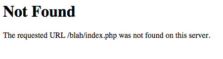

**Not Found** エラー（ページが見つかりませんというエラー）には、いくつかの理由があり、それぞれ、異なる原因によるものです。



> [!Info]  
> 以下の具体例は、Apache webサーバーのものです。最も一般的に使われているサーバーソフトウェアです。

> [!訳注]  
> 「具体例は Apache サーバーのものです」と言った直後に、なぜいきなり IIS サーバーの話が始まるのか、謎です。

<h3 id="iis-use-of-htaccess-file">IIS で .htaccess ファイルを使う</h3>

Web Platform Installer を使って IIS サーバーに URL Rewrite を追加したあと、IIS サーバーを再起動します。IIS の管理インターフェースから URL Rewrite をダブルクリックし、Inbound Rules の下にある Import Rules をクリックし、Rules to Import の下にある Configuration ファイルを閲覧し、ルートにある .htaccess ファイルを選択し、それから Import をクリックします。IIS サーバーを再起動します。これで、Grav にアクセスできます。

<h3 id="missing-htaccess-file">.htaccess ファイルが見つからない</h3>

最初にチェックしてほしいのは、 Grav をインストールしたルートフォルダに、 `.htaccess` ファイルがっ提供されているかどうかです。 .htaccess ファイルは **隠し** ファイルであるため、エクスプローラーや windows のファインダーからは、普通は見えません。 Grav を展開し、ファイルを **選択** し、それから　**移動** もしくは **コピー** した場合、このとても重要なファイルが、前のフォルダに置き去りにされてしまうことがあります。

Grav を展開して、 **すべてのフォルダを** 移し替えることを **強く推奨します** それから、フォルダ名を変更してください。これにより、すべてのファイルが適切な位置を保つことが確認できます。

### AllowOverride All

Grav が提供する `.htaccess` が設定する rewrite ルールで、ルーティング機能が適切に機能するためには、Apache がまずそのファイルを読み込まなければいけません。`<Directory>` や `<VirtualHost>` ディレクティブが、`AllowOverride None` とともにセットアップされると、 `.htaccess` ファイルは完全に無視されます。最もシンプルな解決策は、 RewriteRule が使用可能なところで、この設定を `AlloOverride All` に変更することです。また、Options ディレクティブに、**FollowSymLinks** または **SymLinksIfOwnerMath** が必要です。同じ行の 'Options' の後に '+FollowSymlinks' を追加するだけです。

`AllowOverride` の詳細と、options の設定については、 [Apache ドキュメント](http://httpd.apache.org/docs/2.4/mod/core.html#allowoverride) で探せます。

<h3 id="rewritebase-issue">RewriteBase の問題</h3>

Grav サイトのホームページは読み込まれるのに、 **他のすべてのページ** が _Apache-style_  エラーを表示する場合、最もありうる原因は、 `.htaccess` ファイルに関する問題です。

Grav に付属するデフォルトの `.htaccess` は、ほとんどの場合、すぐに使えます。
しかし、仮想ホストの場合、特定の構成により、ファイルシステムが仮想ホストの設定と直接一致していない場合があります。
これらのケースでは、 `.htaccess` ファイル中の `RewriteBase` オプションを正しい path に設定しなければいけません。

`.htaccess` ファイル自身に、短い説明があります：

```txt
##
# If you are getting 404 errors on subpages, you may have to uncomment the RewriteBase entry
# You should change the '/' to your appropriate subfolder. For example if you have
# your Grav install at the root of your site '/' should work, else it might be something
# along the lines of: RewriteBase /<your_sub_folder>
##

# RewriteBase /
```

単純に、 `RewriteBase /` の前の `#` を、コメント解除するために削除してください。それから、サーバー環境に適合するように path を調整してください。

[htaccess ガイド](../07.htaccess/) では、 `.htaccess` ファイルの場所を特定したり、トラブルシューティングするのを助けるための追加情報を説明しています。

<h3 id="">Rewrite モジュールが見つからない</h3>

いくつかの web サーバーパッケージ（わたしが見たことがあるのは、 EasyPHP と WAMP です！）では、Apache の **rewrite** モジュールがデフォルトで有効な状態とはなっていません。
通常、それらは Apache の設定から有効化できるか、もしくは、 `httpd.conf` の以下の行（もしくはこれに類似する行）をコメントアウトし、 Apache が再読込することで可能です：

```txt
#LoadModule rewrite_module modules/mod_rewrite.so
```

その後、 Apache サーバーを再起動してください。

<h3 id="htaccess-test-script">.htaccess をテストするスクリプト</h3>

`.htaccess` の問題と **rewrite** の問題を切り分けるために、 [htaccess_tester.php](https://gist.githubusercontent.com/rhukster/a727fb70d9341536d49980d1239bd97e/raw/a3078da16b894ba86f9d000bcfc4850e098199fc/htaccess_tester.php) ファイルをダウンロードできます。これを Grav のルートディレクトリに置いてください。

それから、ブラウザで `http://yoursite.com/htaccess_tester.php` を表示してください。成功メッセージと、表示されている Grav の `.htaccess` ファイルのコピーが取得されます。


次に、既存の .htaccess ファイルをバックアップして、 rewrites が機能しているかテストできます：

```bash
mv .htaccess .htaccess-backup
```

それから、以下のシンプルな `.htaccess` ファイルを試してください：

```txt
<IfModule mod_rewrite.c>
    RewriteEngine On
    RewriteRule ^.*$ htaccess_tester.php
</IfModule>
```

その後、この URL を表示させてください： `http://yoursite.com/test` 。実質どの path でも、 `mod_rewrite` が機能していることを示す成功メッセージが表示されます。

テストが終わったら、テストファイルを削除し、 `.htaccess` ファイルを戻してください：

```bash
rm htaccess_tester.php
mv .htaccess-backup .htaccess
```

<h3 id="grav-error-404-page">Grav の 404 ページ</h3>


_Grav スタイルで_ **Error 404** のエラーが表示された場合は、 `.htaccess` は正しく機能していますが、 Grav が探せないページを表示しようとしています。

この問題の最もよくある原因は、単に、ページが移動したか、名前を変更したことによるものです。もうひとつチェックするのは、ページの YAML フロントマターに `slug` が設定されているかどうかです。
これは、デフォルトでは URL 構築に使われるフォルダ名を明示的に上書きします。

別の原因としては、ページが **not routable** である可能性です。ページの routale オプションは、ページの[フロントマター](../../02.content/01.headers/) で設定できます。

<h3 id="404-page-not-found-on-nginx">Nginx での 404 Page Not Found</h3>

サイトがサブフォルダーにある場合は、 nginx.conf の location をそのサブフォルダーへ確実に向けてください。 Grav の [nginx.conf サンプル](https://github.com/getgrav/grav/blob/master/webserver-configs/nginx.conf) では、コード内に方法を説明するコメントが含まれています。

ホームページでは動くのに、他のページでは not found になる場合は、 nginx.conf が、サンプルの nginx.conf のとおりに設定されているか、確認してください。

