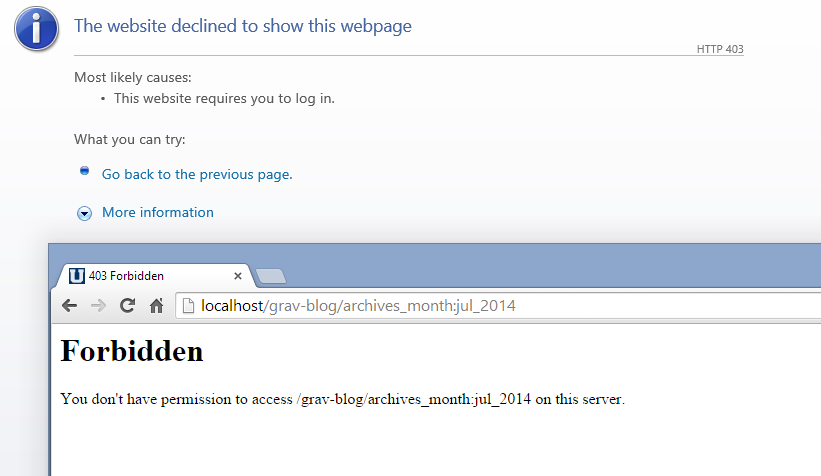

**Windows** の **Apache** で、403 forbidden エラーが発生するという、曖昧ですが根の深い問題があります。

基本的に、Apache は URL に `:`を使うことを許可しません。Windows 以外のシステムでは URL 内のコロンは機能しますが、 Windows のパスに、 `C:\some\path` のようにコロンが使われるという事実のため、セキュリティ上の懸念から、Windows では許可されません。

パラメータ用のセパレータを、デフォルトの `:` から変更設定するオプションを提供しています。

`user/config/system.yaml` を編集して、次の行をファイルの上部に追記してください：

```yaml
param_sep: ';'
```

これにより、Grav はパラメータに対してコロンではなくセミコロンを使うようになります。たとえば、 `http://yoursite.com/blog/tag:something` は、 `http://yoursite.com/blog/tag;something` になります。

<h2 id="403-issue-in-admin">管理パネルでの 403 問題</h2>

`mod_security` がインストールされている場合、rule 350147 が誤検知するという報告があります (http://wiki.atomicorp.com/wiki/index.php/WAF_350147) 。その rule をホワイトリストに入れるか、ホスティング会社に訊ねて、サポートを受けてください。

```yaml
ModSecurity: [file "/etc/httpd/conf/modsecurity.d/rules/tortix/modsec/50_plesk_basic_asl_rules.conf"] [line "308"] [id "350147"] [rev "143"] [msg "Protected by Atomicorp.com Basic Non-Realtime WAF Rules: Potentially Untrusted Web Content Detected"] [data ""] [severity "CRITICAL"] Access denied with code 403 (phase 2). Match of "rx ((?:submit(?:\\+| )?(request)?(?:\\+| )?>+|<<(?:\\+| )remove|(?:sign ?in|log ?(?:in|out)|next|modifier|envoyer|add|continue|weiter|account|results|select)?(?:\\+| )?>+)$|^< ?\\??(?: |\\+)?xml|^<samlp|^>> ?$)" against "ARGS:notifications" required. [hostname "mydomain"] [uri "/grav/admin/notifications.json/task:processNotifications"] [unique_id "WXoYHcpkEKz0qCI66845gQAAAAo"], referer: http://mydomain/grav/admin/tools
```

