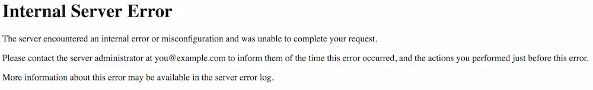

Grav には、独自の `.htaccess` ファイルが付属しています。このファイルによって、 Grav は適切に操作できます。このファイルは、ルートフォルダにあり続けている必要があります。 `.htaccess` ファイルを使って解決できる問題に出会うかもしれません。

Apache サーバーは、現在利用できる、もっとも人気のあるサーバーのひとつです。無料であり、ほとんどどこでも幅広く使えます。不幸なことに、 Apache も完璧ではありません。ときどき、 `.htaccess` ファイルが頭痛の種になることがあります。気にすることはありません。それはほとんどいつも柔軟に対応できます。

<h2 id="how-to-edit-htaccess-in-windows-and-macos">Windows や maxOS で .htaccess の編集方法</h2>

.htaccess ファイルは、隠しファイルです。つまり、デフォルトでは macOS や Windows ユーザーには、ファイルマネージャー（ファインダー）で、このファイルが見えません。隠しファイルの表示を有効化しなければいけません。

**macOS** では：

1. **Terminal** を開いてください。
2. **Terminal** に `defaults write com.apple.finder AppleShowAllFiles YES` と入力し、 **return** キーを押してください。
3. **Terminal** に `killall Finder` を入力し、 **return** を押してください。

これで Grav を展開したフォルダの root ディレクトリに、 `.htaccess` ファイルが見えるようになったはずです。設定をもとの隠す状態に戻したいなら、この処理を繰り返し、 ステップ2 の `YES` になっているところを `NO` にして入力してください。

**Windows 10** では：

1. **File Explorer** を開いてください。
2. **View** タブを選択してください。
3. **Hidden Items** のとなりのボックスにチェックを付けてください。

このボックスのチェックをはずすと、隠しファイルが隠れる状態に戻ります。 **File Explorer** に戻ると、デフォルトの状態になっています。

## Testing .htaccess

Let's say you go to your browser and navigate to your new Grav site and... it's not there! A big, bold message stating `Not Found` is where your beautiful Grav site should be. This is not a fun problem to have, but the solution could be as simple as adjusting your `.htaccess` file.

The first step in troubleshooting issues with the `.htaccess` file should be making sure that the file is actually being picked up and utilized by the server. Make sure the file is in the root directory of your Grav site where it should be, and that it is properly named `.htaccess` with a leading (`.`) period.

If the file is there, your next step is to give it a test and make sure your server is picking it up. This is a simple process that involves adding a single line at the top of the file.

To test, open up the `.htaccess` file in a text editor. Then, you'll want to create a new first line and place the text `Test.` and save.



This error doesn't solve your problem by itself, but it does let you know that the `.htaccess` in the root directory of your Grav site is the one your server is parsing.

If you don't receive this error, make sure you have the file in your site's root directory. This should be the file included with the original Grav install. This is one of the reasons we recommend unpacking the zipped Grav directory and moving that directory where you want your site to be on your server, rather than copying the files and pasting them. This ensures that all of the files and the directory structure is kept the same, avoiding issues like these.

## Troubleshooting a Broken .htaccess

If nothing changed when you edited the .htaccess file, you may need to make sure that `.htaccess` is enabled. If not, your server won't even look for it in the first place.

Here's what you can do:

Find and open `httpd.conf` or `apache.conf` file in a text editor. In Windows, this will probably be Notepad or a text editor made for development. Word processors can add unnecessary information that could make the problem worse.

Next, you'll want to look for the `Directory` area of the file. There should be a block of text like this:

```txt
    #
    # AllowOverride controls what directives may be placed in .htaccess files.
    # It can be "All", "None", or any combination of the keywords:
    #   Options FileInfo AuthConfig Limit
    #
    AllowOverride All
```

If `AllowOverride` is set to `None` or anything other than `All`, you will need to change it to `All` and save. This change will require a reset of your Apache server to register.

Once you have done this, give your site another test.

We've also included troubleshooting guides to help you should you encounter a [404](../01.page-not-found/) or [500](../03.internal-server-error/) internal server error while working with Grav.

## Htaccess Examples 

[https://www.askapache.com/htaccess/](https://www.askapache.com/htaccess/)

