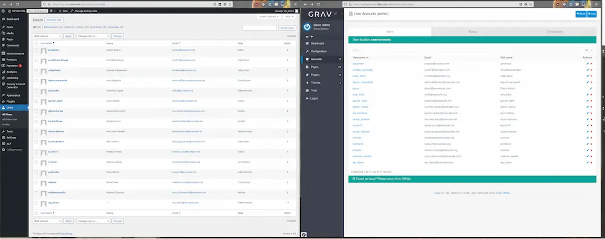
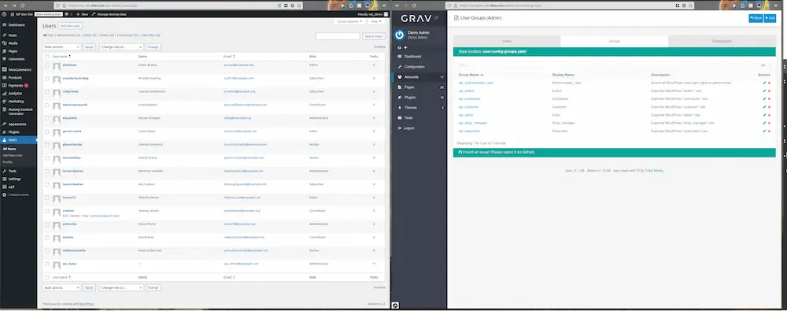
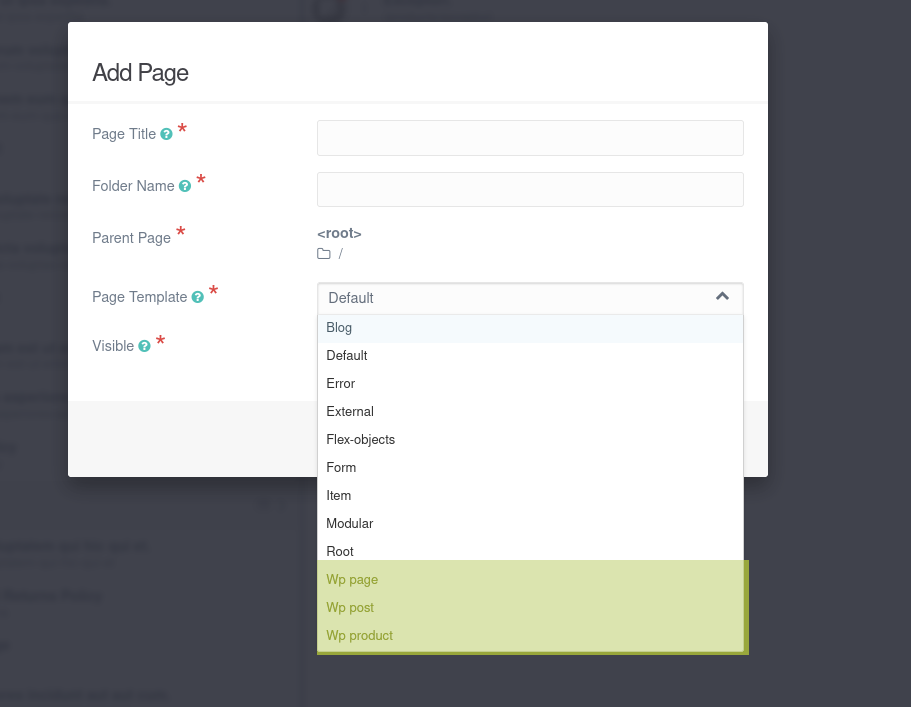
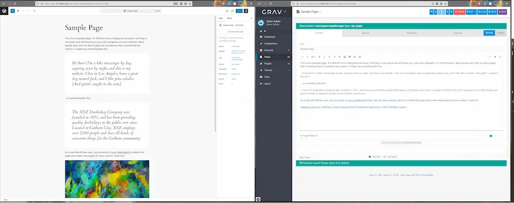
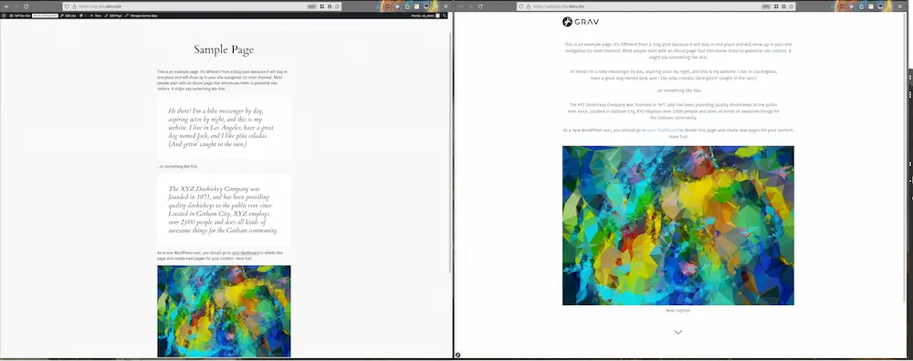
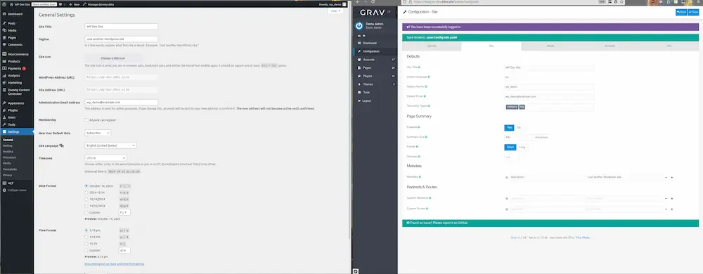

<h2 id="requirements">要件</h2>

* PHP v7.1 以上 composer の依存関係のため
* その WordPress がホストされている環境に [WP-CLI](https://wp-cli.org/) がインストールされている
* エクスポートされるコンテンツのある WordPress が機能している
* WordPress サイトの `wp-content/uploads` に読み/書きのアクセスができる
* Grav がホストされる環境に [Composer](https://getcomposer.org/) がインストールされている

<h2 id="installation">インストール</h2>

1. Download the latest release of the [wp2grav_exporter](https://github.com/jgonyea/wp2grav_exporter/releases) plugin and upload it to your WordPress's `wp-content/plugins` directory.
2. Run `composer install --no-dev` within the `wp2grav_exporter` directory to install dependencies.
3. Enable the new plugin:
   - Using wp-cli: `wp plugin activate wp2grav_exporter`, or - Via the admin GUI.
4. Run `wp wp2grav-all` to export all items.  See other options below.
5. Exported files are located at `WP_ROOT/wp-content/uploads/wp2grav-exports/DATE`
6. For Grav v1.6 sites, [https://github.com/david-szabo97/grav-plugin-admin-addon-user-manager](admin-addon-user-manager) is recommended to view and manage users.  This is not required for Grav 1.7+ sites.

<h2 id="notes">注意点</h2>

> Running `wp wp2grav-all` will run each of the following export steps at once.  Afterwards, follow each section below on how to import the new data to a Grav install.

<h2 id="exporting-users-from-wordpress">WordPressからユーザーのエクスポート</h2>

WordPress users on left exported to Grav on the right.

<h3 id="command">コマンド</h3>

`wp wp2grav-users` will generate Grav user account files.

<h3 id="results">結果</h3>

* User accounts in the export directory under `EXPORT/accounts/`.
  * Usernames will be padded to a minimum of 3 characters, maximum of 16.
  * If a username is truncated or padded, the username will also have the WordPress uid to avoid collisions.
  * Passwords in each account are randomly generated, and have no connection with the respective WordPress account.  The plaintext password automatically converts to a hashed_password once the account authenticates for the first time.

<h3 id="importing-users-to-grav">Gravへのユーザーのインポート</h3>

Copy the `EXPORT/accounts` directory to your `user` directory (e.g. username.yaml files should be placed at `user/accounts`).

<h2 id="exporting-user-roles-from-wordpress">WordPressからユーザーロールのエクスポート</h2>

WordPress users with roles on left exported to Grav groups on the right.

<h3 id="command-1">コマンド</h3>

`wp wp2grav-roles` will generate a Grav groups.yaml file.

<h3 id="results-1">結果</h3>

WordPress user roles export as Grav groups in a `groups.yaml` file at `config/groups.yaml`. Some notes about the role exporting:

* Each WordPress role is converted to the Grav group `wp_<ROLE_WITH_UNDERSCORES>` (e.g. `subscriber` becomes `wp_subscriber`).
* WordPress users with administrator roles receive the `wp_administrator` group.
* The `wp_administrator` group receives `admin.super` access along with `admin.login` access.  Accounts with these permissions are full admins on the site!
* A new Grav group called `wp_authenticated_user` group receives `admin.login` access.
* All accounts receive the "wp_authenticated_user" group.

<h3 id="importing-user-roles">ユーザーロールのインポート</h3>

Copy the `EXPORT/config` directory to `users/config`.

<h2 id="exporting-post-types-from-wordpress">WordPressから投稿タイプのエクスポート</h2>

WordPress post types are converte to Grav page types, with a pre-pended "WP" in front of each type (highlighted in yellow here).

<h3 id="command-2">コマンド</h3>

* `wp wp2grav-post-types` will generate a basic Grav plugin, along with page types that match the WordPress post types.

<h3 id="results-2">結果</h3>

* A Grav plugin will be generated that will present basic field functionality within the Admin tool.

<h3 id="importing-post-types-to-grav">Gravへの投稿タイプのインポート</h3>

* Copy the `EXPORT/plugins` directory to your `user` directory
* Navigate to the Grav plugin directory `user/plugins/wordpress-exporter-helper` and run `composer install`.

<h2 id="exporting-posts-from-wordpress">WordPressから投稿のエクスポート</h2>

Admin view of WordPress "Sample Page" on left exported to Grav markdown on the right.

User view of WordPress "Sample Page" on left exported and rendered via Grav on the right.

<h3 id="command-3">コマンド</h3>

* `wp wp2grav-posts` will export all posts.

<h3 id="results-3">結果</h3>

* Each post/page will be exported to directories matching metadata from the post, typically the post/ page title.
* Library media will be copied to the `data/wp-content` and in-line content will (eventually) be included within the page's directory.

<h3 id="importing-posts-to-grav">Gravへの投稿のインポート</h3>

* Copy the `EXPORT/pages` directory to your `user` directory
* Copy the `EXPORT/data` directory to your `user` directory

<h2 id="exporting-site-metadata-from-wordpress">WordPressからサイトのメタデータのエクスポート</h2>

Admin view of WordPress General Settings on left exported to Grav Site Config on the right.

<h3 id="command-4">コマンド</h3>

* `wp wp2grav-site` will export site metadata.

<h3 id="results-4">結果</h3>

* Grav site metadata is stored in `EXPORT/config/site.yaml`.

<h3 id="importing-site-metadata-to-grav">Gravへのサイトのメタデータのインポート</h3>

* Copy the `EXPORT/config/site.yaml` directory to Grav at `user/config/site.yaml`.

